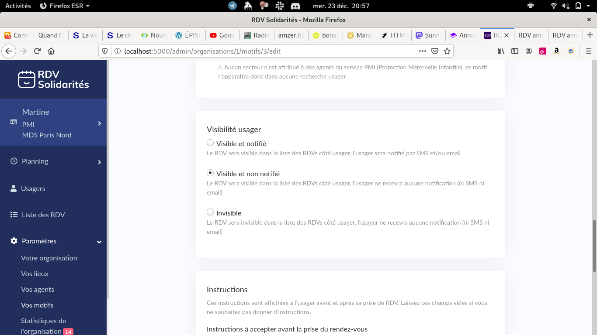
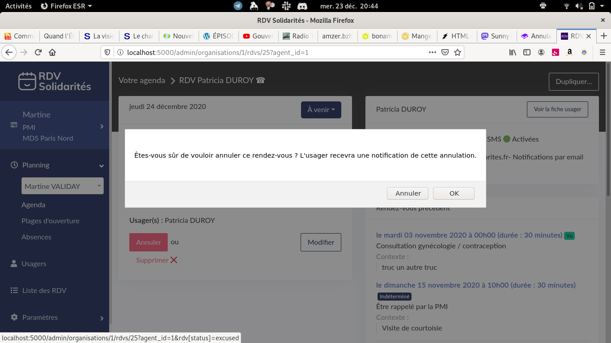
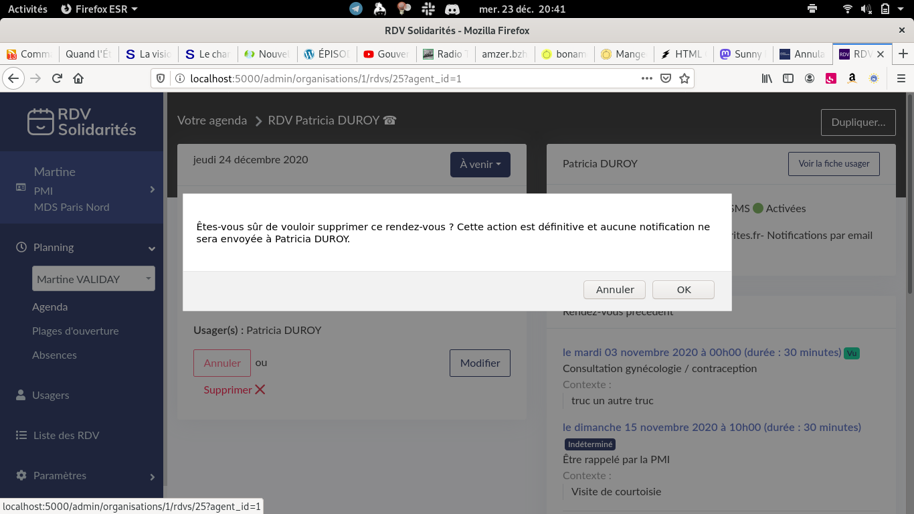
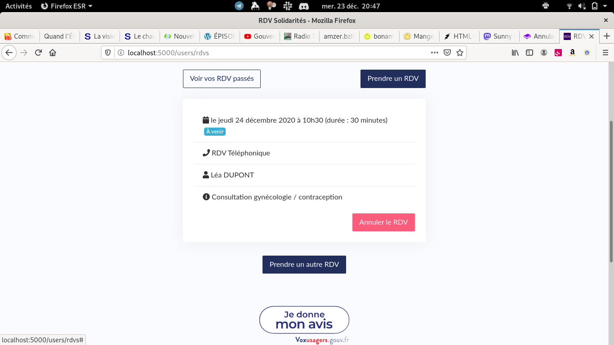
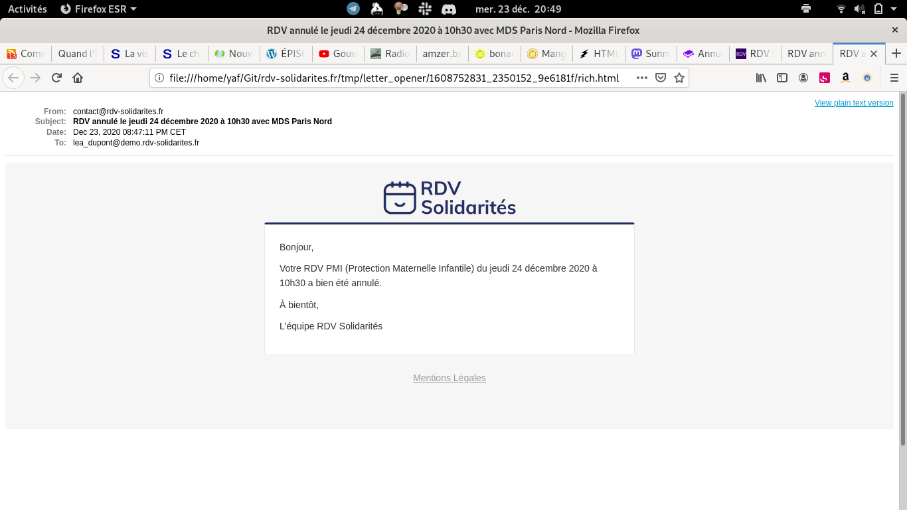
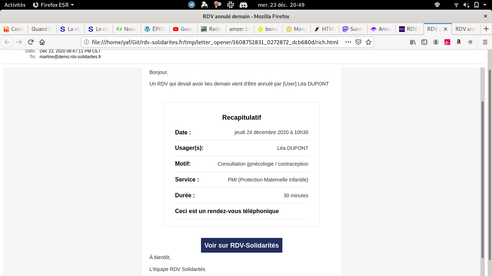

# Annulation de Rendez-vous

### Annulation agent

Depuis l'interface agent, via la fiche d'un rendez-vous, les agents peuvent annuler ou supprimer un rendez-vous.

#### Annulation d'un rendez-vous

Pour qu'une notification soit envoyé à l'usager, il faut que le motif soit configuré en « visible et notifié ».

Si l'usager n'a pas autorisé ou renseigner d’e-mail et/ou de numéro de téléphone, aucune notification ne pourra être effectué.

Après avoir confirmé l'action, l'annulation du rendez-vous se fera en envoyant une notification à l'usager \(si le motif l'autorise\).

#### Suppression d'un rendez-vous

Après avoir confirmé l'action, la suppression du rendez-vous se fera sans envoyer de notification.

**Attention : cette opération est irreversible. Nous ne pourrons pas récupérer le rendez-vous ainsi supprimé.**

### Annulation usager

L'usager peut annuler un rendez-vous depuis son espace à condition que celui-ci  ait lieu dans au moins 4 heures

### Statut

Dans le cas d'une suppression par l'agent, le rendez-vous n'apparaît plus, et n'a donc pas de statut particulier \(le rendez-vous n'existe plus\)

Dans les autres cas d'annulation \(agent et usager\), le rendez-vous passe en statut « Absent excusé »

