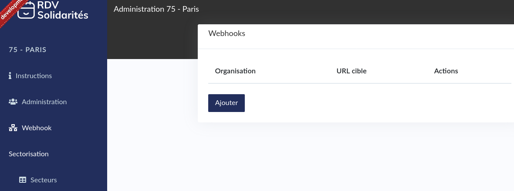
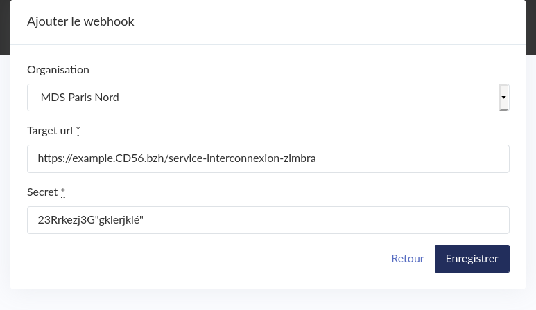

# Configuration Territoire

### Webhook

_\(Ce titre est sans doute à modifier pour le rendre plus compréhensible par les agents concernés\)_

L'entrée de menu correspondante affiche une liste des webhooks actuellement configurées.

Dans l'ajout d'un webhook, il faut 

* choisir l'organisation liée
* l'URL \(qui doit être en HTTPS\)
* le secret \(sorte de mot de passe que s'échangeront les systèmes pour s'assurer qu'ils se connaissent\)

