# Tutoriel

## Comment démarrer sur RDV-solidarités ?

### Étape 1 : Effectuer le paramétrage

Les paramètres sont toutes les informations qui structurent votre service dans la prise de RDV. Ils peuvent être modifiés à tout moment d’utilisation de l’outil. Seuls les agents possédant le profil « administrateur » ont l’accès aux paramètres.

#### Votre organisation

Ajoutez les horaires d’ouverture et le numéro de téléphone de votre organisation. Ces informations apparaissent à l’usager lorsque celui-ci cherche à prendre RDV dans votre département et qu’aucune consultation n’est proposée à la prise de RDV en ligne. Ainsi l’usager à toujours le moyen de contacter le service.

#### Vos lieux

Il s’agit ici de lister tous les lieux sur lesquels les agents effectuent des consultations \(MDS ou tiers lieu\). Cliquez sur « Ajouter un lieu » Renseignez le nom et l’adresse Cliquez sur « Créer »

Le lieu s’inscrit alors dans la liste des lieux.

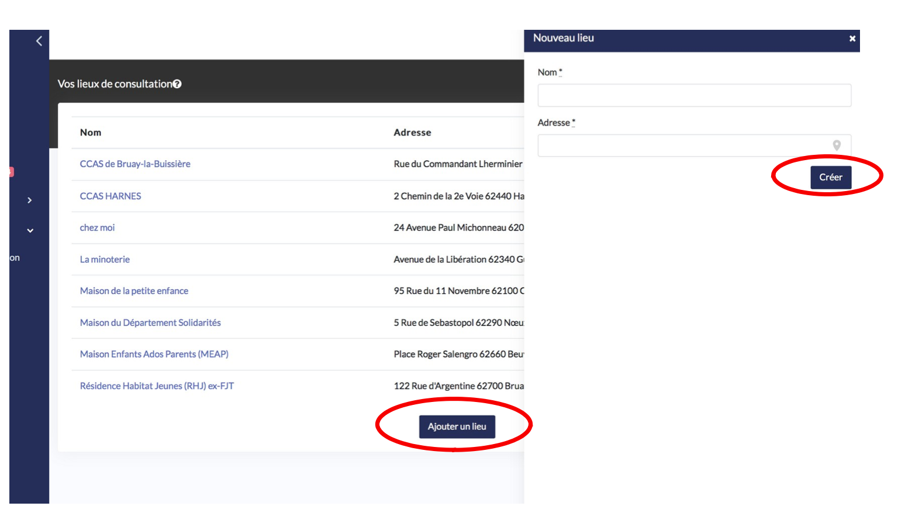

#### Vos agents

Il s’agit ici de gérer les équipes : inviter ou supprimer un agent de votre organisation.

Comment inviter un professionnel à rejoindre l’outil ?

* Cliquez sur « invitez un professionnel »
* Renseignez son adresse email
* Choisissiez le service auquel appartient cet agent : PMI, service social ou secrétariat
* Attribuez-lui un rôle :
  * Administrateur : vous lui permettez d’accéder aux paramètres. Il a accès à tous les agendas en lecture et modification.
  * Utilisateur : il n’a pas accès aux paramètres et a accès uniquement aux agendas des agents de son service.

A savoir : tous les agents du service secrétariat ont aussi accès à l’ensemble des agendas et lecture et modification.

#### Comment modifier le rôle d’un professionnel ?

* Cliquez sur le nom de l’agent
* Changez le rôle
* Cliquez sur « modifier »

#### Comment supprimer un professionnel ?

* Cliquez sur le nom de l’agent
* Cliquez sur « supprimer » dans le bandeau s’affichant à droite

#### Vos motifs

Il s’agit ici de lister tous les motifs de rendez-vous effectués par la PMI, le social et le secrétariat.

**Comment créer un motif ?**

* Cliquez sur « créer un motif »

#### Configuration générale :

* Choisissez le service concerné
* Choisissez un nom dans la liste proposée. Si le motif que vous souhaitez créer n’est pas compris dans ce référentiel adressez-vous à l’équipe RDV-solidarités afin qu’il y soit ajouté.
* Choisissez une durée par défaut du RDV. Cette durée permet de proposer des créneaux au usagers pour la prise de RDV en ligne. En revanche si c’est le professionnel qui pose le RDV, la durée du RDV peut être modifiée.
* Choisissez une couleur associée à ce motif. Les RDV de ce motif apparaitront dans la couleur choisie sur le calendrier.

#### Type de RDV

* Choisissez le type de RDV adapté :
  * Sur place : c’est un RDV en présentiel qui aura lieu au lieu sélectionné
  * Par téléphone : L'usager sera notifié que le RDV se passera par téléphone, au numéro indiqué dans son profil.
  * A domicile : L'usager sera notifié que le RDV aura lieu à l'adresse remplie dans son profil.

#### RDV de suivi

Cochez cette case si vous souhaitez que le motif soit réservé aux usagers bénéficiant d’un accompagnement et pour lesquels on a nommé un référent sur leur fiche usager. Les motifs « RDV de suivi » permettent à l’usager d’accéder uniquement aux disponibilités de son agent référent lors de la prise de RDV en ligne.

#### RDV secrétariat

* Si le motif de RDV peut être effectué par un agent du secrétariat, alors cochez la case « Le RDV pourra être effectué par le service secrétariat »

  N.B : Si c’est un RDV de type « A domicile » alors il est impossible de cocher cette case, l’option apparaitra grisée.

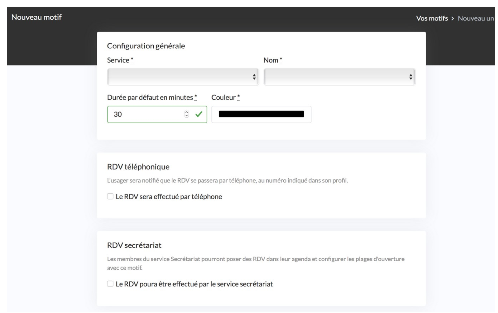

#### Prise de RDV en ligne par les usagers

* Si vous souhaitez permettre aux usagers de prendre RDV en ligne pour ce motif, alors cochez « RDV en ligne ». Si vous souhaitez que seuls les agents posent les RDV alors laissez la case « non-cochée\).
* Délai minimum de réservation : choisissez le délai minimum que vous autorisez à l’usager pour la prise de RDV en ligne. Par exemple 1 heure, l’usager verra les créneaux disponibles jusqu’à une heure avant le RDV.
* Délai maximum de réservation : choisissez le délai maximum que vous autorisez l’usager pour la prise de RDV en ligne. Par exemple 3 moi, l’usager verra tous les créneaux disponibles sur les trois prochains mois.

#### Notifications des usagers par email et SMS

* Notification des usagers par email et par SMS : cochez si vous souhaitez désactiver toutes les notifications aux usagers pour les RDV de ce motif.

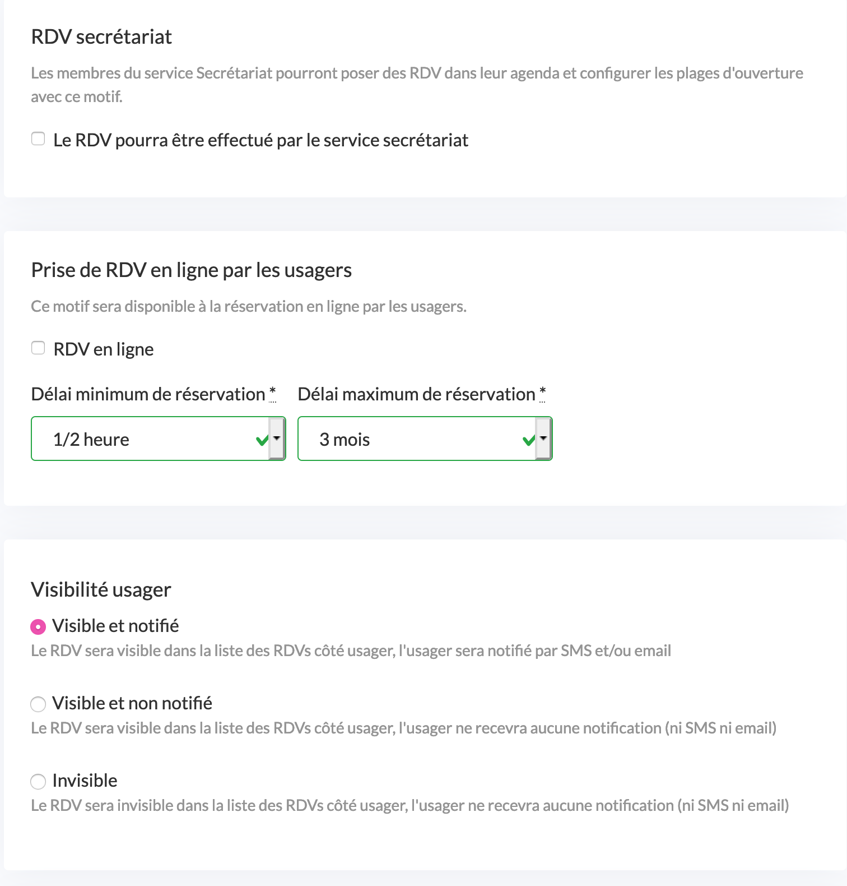

#### Instructions

* Instructions : ajoutez des instructions afin de donner des informations personnalisées aux usagers lors de la prise de RDV en ligne.
  * « Instructions à accepter avant la prise du rendez-vous » : elles apparaissent avant la confirmation du RDV par l’usager.
  * « Indications affichées après la confirmation du rendez-vous» : elles apparaissent sur la page de confirmation et sur l’email de confirmation envoyé à l’usager.

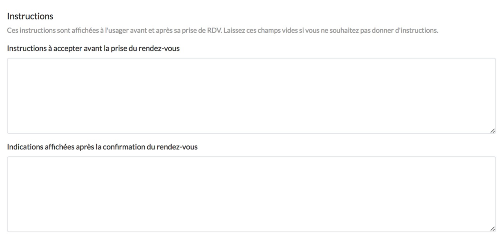

Une fois toutes ces informations renseignées cliquez sur « créer ».

Le motif apparait désormais dans votre liste.

#### Vos statistiques globales

Cette page vous permet de suivre l’activité de votre organisation et l’usage fait de la plateforme. Vous avez une vue sur tous les RDVs :

* A renseigner : les RDVs auxquels les agents n’ont pas donné de statut. Vous avez ici l’opportunité de tous les balayer et leur attribuer le statut correct.
* Vus : RDVs s’étant déroulé dans le passé
* A venir
* Excusés : RDVs annulé par l’usager ou l’agent
* Non-excusés : lapins posés par les usagers

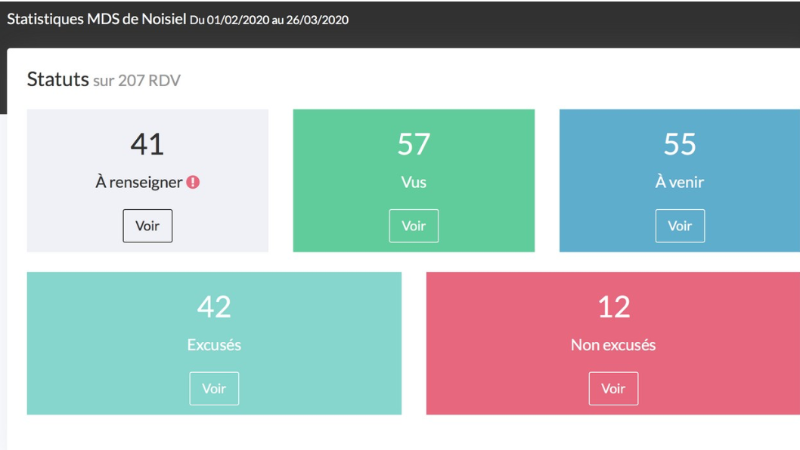

Vous disposez aussi de l’évolution du nombre de RDVs créés \(par les usagers ou les agents\), de RDV créés par type de RDV et par service et du nombre d’usagers créés.

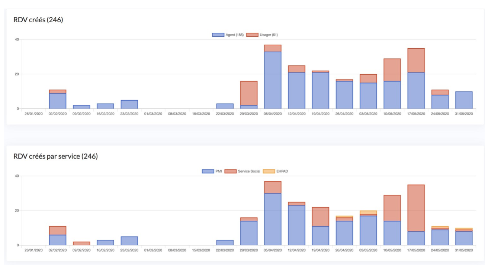

### Étape 2 : Définir votre planning

Cette section vous permet de déclarer des disponibilités et des absences.

#### Plages d’ouverture

Déclarer des plages d’ouverture est utile pour deux choses :

* la prise de rendez-vous en ligne afin de mettre des créneaux de RDV à disposition des usagers.
* La pose de RDV par le secrétariat afin qu’il ait connaissance de vos disponibilités.

Un onglet dédié vous permet de déclarer des moments où vous êtes disponibles pour recevoir des usagers pour certains motifs et sur certains lieux. Comment créer une plage d’ouverture ?

* Cliquez sur « Créer une plage d’ouverture »
* Renseignez le nom de la plage d’ouverture. Par exemple : « consultation de PMI », « permanence sociale ».
* Lieu : choisissez un lieu où les consultations seront réalisées parmi la liste proposée
* Premier jour : date à laquelle commence cette plage d’ouverture
* « Commence à », « termine à » : précisez les horaires de cette plage d’ouverture.
* Motifs : cochez tous les motifs de consultations traités sur cette plage d’ouverture. Vous pouvez en sélectionner autant que vous le souhaitez.

* « Répéter la plage d’ouverture… » : en cochant cette case vous avez la possibilité plage d’ouverture Cliquez sur « créer » afin d’enregistrer la plage d’ouverture.

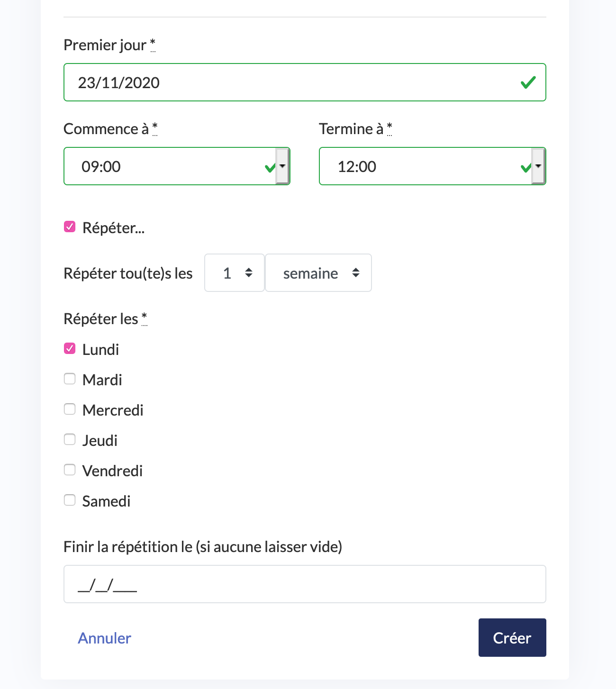

Elle s’affiche désormais dans la liste.

#### Absences

Vous avez la possibilité de déclarer une absence afin que l’outil retire vos disponibilités dans la prise de rendez-vous en ligne et pour rendre l’absence visible sur votre calendrier.

**Comment créer une absence ?**

* Cliquez sur « créer une absence »
* Donnez un nom à cette absence dans « nom ». Vous pouvez par exemple écrire le motif de l’absence ou simplement écrire « absence » si vous ne souhaitez pas renseigner de motif.
* Donner le début et la fin de votre absence dans « commence à » et « Termine à ».
* « Répéter… » : cette case vous donne la possibilité d d’ajouter une récurrence à cette absence par semaine et jours de la semaine et de définir une date de fin de cette récurrence.
* Cliquez sur « créer »

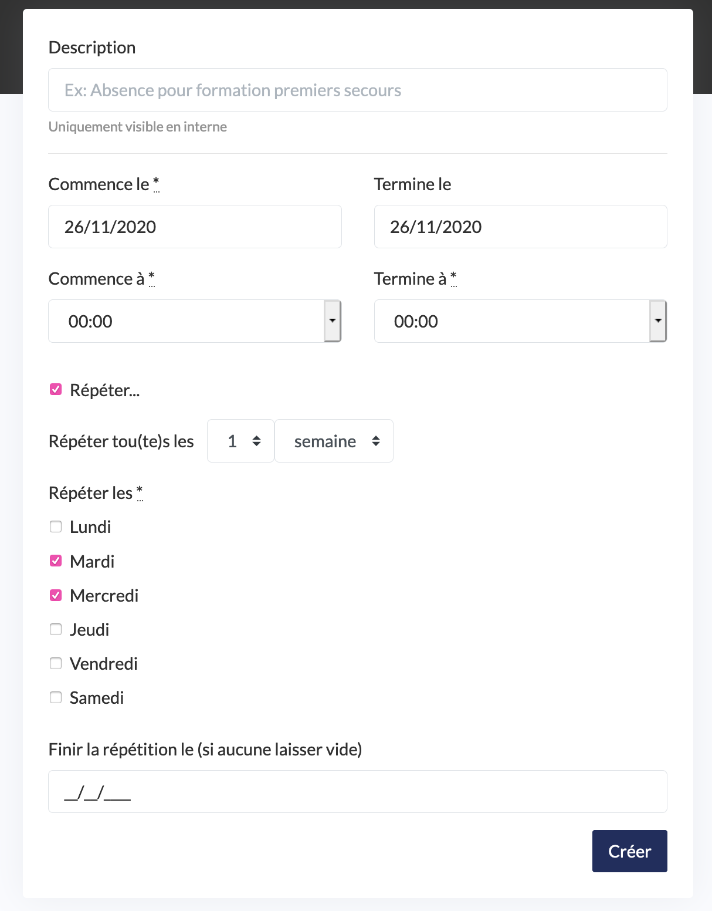

Votre absence s’affiche maintenant dans la liste et est visible sur votre calendrier.

**Comment supprimer une absence ?**

* Cliquez sur le nom de l’absence dans la liste
* Cliquez sur « supprimer »
* Confirmez la suppression

**Comment modifier une absence ?**

* Cliquez sur le nom de l’absence dans la liste
* Effectuez les modifications nécessaires
* Cliquez sur « modifier »

### Étape 3 : Créer votre base d’usagers

C’est ici que vous trouverez votre base d’usagers. Cette base est alimentée par deux canaux :

* Les fiches usagers créées par les usagers lors de la prise de rendez-vous en ligne
* Les fiches usagers créées par les agents

Il existe deux profils d’usagers : les responsables et les proches.

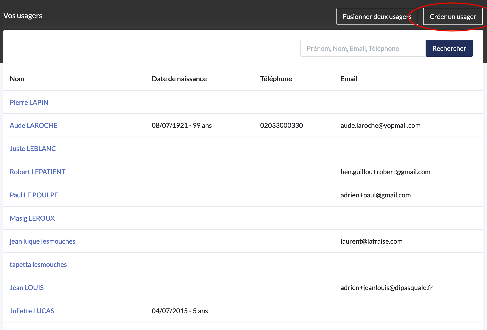

#### Comment créer une fiche usager en charge ?

* Cliquez sur « créer un usager » en haut à droite de la page et en bas de page.
* Renseignez les informations sur l’usager. Les deux seules informations obligatoires sont le Nom et le Prénom de l’usager.
* Cliquez sur « créer »

La fiche usager apparait désormais dans la liste.

N.B le champs « Agent\(s\) référent\(s\) » permet d’inscrire l’usager dans une démarche d’accompagnement en lui attribuant un ou plusieurs agents référents. Inscrire un agent référent permet deux choses :

* Permettre aux autres agents notamment le secrétariat de connaitre l’agent en charge de l’accompagnement afin qu’ils puissent vous poser un RDV avec cet usager.
* S’il existe un motif de type « RDV de suivi » ouvert en ligne cela permet à l’usager de n’avoir accès qu’aux disponibilités de l’agent référent.

#### Comment créer une fiche usager proche ?

Cela suppose la création préalable d’une fiche « usager en charge »

* Cliquez sur le nom du parent dans la base usager
* Cliquez sur « Ajouter un proche » dans le cadran « proches » à droite de la page.
* Renseignez les informations du proche. Seuls le prénom et le nom sont obligatoires.
* Cliquez sur « créer »

Le proche apparait désormais dans la fiche de l’usager en charge. Le proche possède désormais sa propre fiche qui apparait dans la base usager.

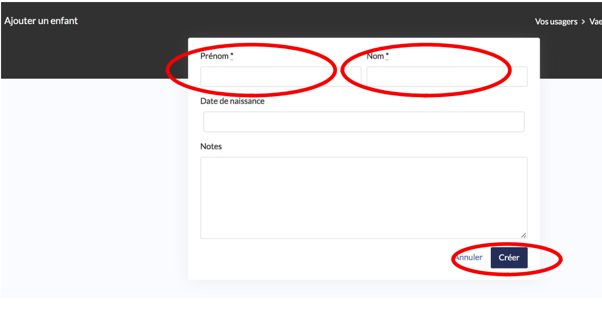

#### Comment consulter l’historique des rendez-vous d’un usager ?

Chaque fiche usager contient le suivi de ses rendez-vous avec vos services.

* A renseigner : rendez-vous passés sans statut attribué par l’agent.
* Vu : rendez-vous passés honorés par l’usager
* A venir : rendez-vous futurs
* Excusé : rendez-vous passés non-honorés par l’usager mais annulés par l’usager
* Non excusé : rendez-vous non-honorés et non annulés soit les lapins.

Pour consulter tout l’historique des rendez-vous cliquez sur « voir tous les rendez-vous » dans la fiche usager.

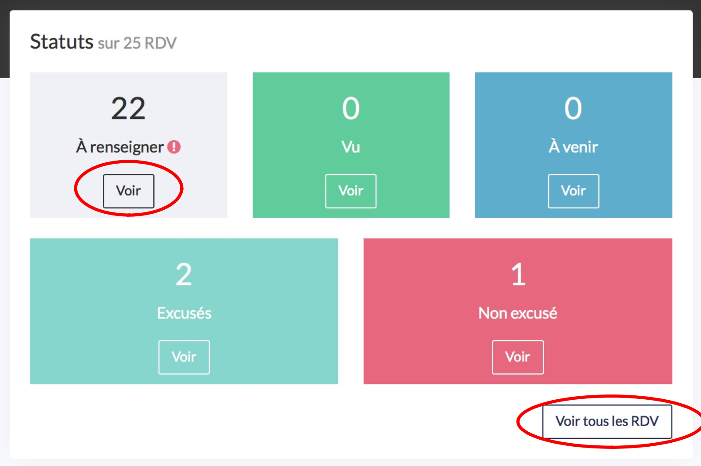

#### Comment rechercher un usager dans la base usager ?

Vous pouvez effectuer une recherche rapide de l’usager en renseignant dans la barre de recherche en haut à droite une des informations suivantes : nom, prénom, email. Vous pouvez rechercher un usager parent comme un enfant.

### Étape 4 : comment gérer ses rendez-vous ?

Rendez-vous dans l’onglet « Vos agendas ». Vous avez par défaut accès à votre propre calendrier. Si vous bénéficiez d’un rôle d’administrateur ou si vous appartenez au service du secrétariat alors vous avez aussi accès aux agendas des autres agents.

Vous avez la possibilité d’avoir une vue de votre calendrier par statut de RDV en cliquant sur « Tous les RDVs ». Ne s’afficheront alors que les RDV ayant le statut sélectionné.

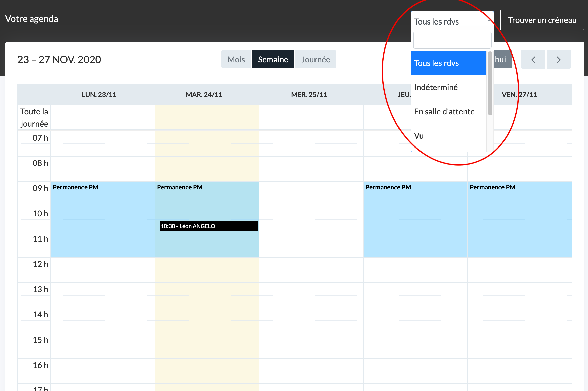

#### Comment accéder au calendrier d’un autre agent ?

* Dans la barre de gauche , cliquez sur le menu déroulant sur lequel figure votre nom
* Chercher le nom de l’agent souhaitez et cliquez dessus
* Son calendrier s’affiche

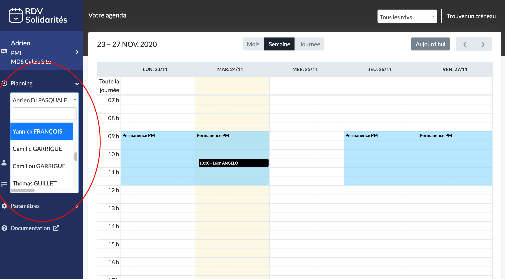

**Pour revenir à votre agenda :**

Recherchez de nouveau votre nom dans le menu déroulant.

#### Comment poser un rendez-vous ?

Deux moyens permettent de poser un rendez-vous :

**1. Directement sur l’agenda de l’agent**

* Cliquez sur un créneau
* Choisissez le motif du rendez-vous
* Cliquez sur « continuer »
* Cliquez dans la barre de recherche « usagers » et commencez à taper le prénom ou le nom de l’usager jusqu’à ce que l’usager apparaisse dans la liste et cliquez sur l’usager recherché. Son nom apparait désormais dans la barre « usagers ». S’il s’agit d’un nouvel usager alors cliquez sur « Créer un usager », remplissez la fiche et cliquez sur « créer usager ».
* Ajoutez des notes libres concernant le RDV permettant de le contextualiser
* Cliquez sur « continuer »
* Vérifiez ou modifiez la date, l’horaire et la durée proposée
* Sélectionnez un lieu dans la liste proposée
* Cliquez dans la barre de recherche « agents » afin de sélectionner le ou les agents qui effectueront le rendez-vous.
* Cliquez sur « Créer RDV »

Le rendez-vous apparait désormais dans le calendrier.

**2. Recherche de tous les créneaux disponibles**

* Cliquez sur « Trouver un créneau » en haut à droite du calendrier
* Sélectionnez un motif
* Choisissez une date de à partir de laquelle vous souhaitez consulter les disponibilités \(facultatif\), un ou plusieurs agents \(facultatif\), un ou plusieurs lieux \(facultatif\)
* Cliquez sur « afficher les créneaux »

  Apparaissent alors toutes les disponibilités selon les critères que vous avez appliqués.

  Les disponibilités apparaissent par lieux. Chaque créneau disponible mentionne le nom de l’agent.

* Utilisez les flèches sur la droite pour naviguer vers les prochaines disponibilités.
* Une fois le créneau choisi, cliquez dessus
* Cliquez dans la barre de recherche « usagers » et commencez à taper le prénom ou le nom de l’usager jusqu’à ce que l’usager apparaisse dans la liste et cliquez sur l’usager recherché. Son nom apparait désormais dans la barre « usagers »
* Cliquez sur « continuer »

Le rendez-vous apparait désormais dans le calendrier.

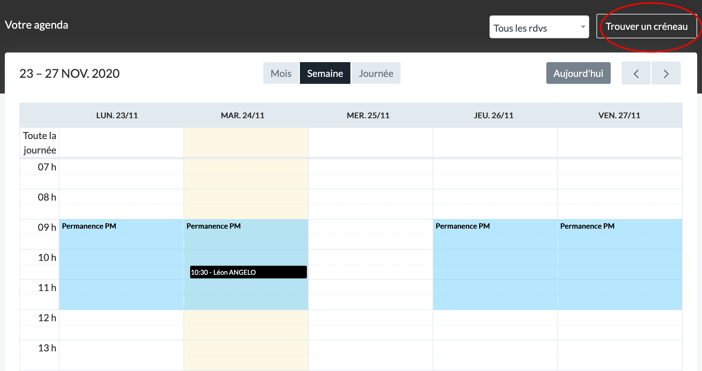

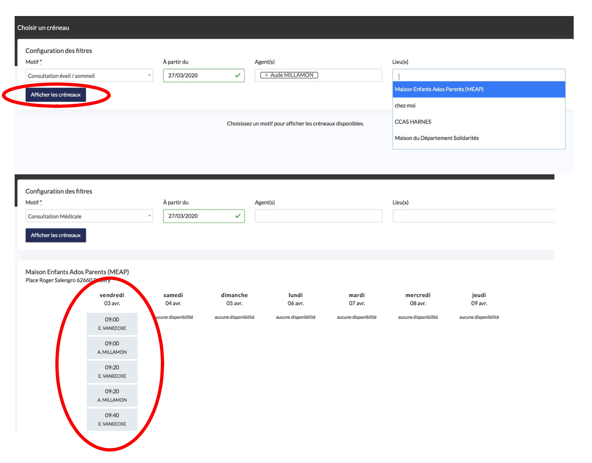

#### Comment consulter le résumé d’un rendez-vous ?

* Recherchez le rendez-vous en naviguant sur le calendrier
* Cliquez sur le créneau du rendez-vous
* Le résumé s’affiche sur une nouvelle page

#### Comment supprimer un rendez-vous ?

* Dans le résumé du rendez-vous, cliquez sur « supprimer »
* Confirmez la suppression

  Le RDV disparait de l’agenda et des statistiques. Dans le cas d’une annulation veuillez utiliser les statuts « Absent excusé » ou « Absent non excusé ».

  La suppression du rendez-vous n’est pas notifiée à l’usager de manière automatique. Il vous faut avertir l’usager et reprogrammer un rendez-vous avec lui.

#### Comment modifier un rendez-vous ?

* Dans le résumé du rendez-vous, effectuez les modifications nécessaires
* Cliquez sur « modifier »

La modification du rendez-vous n’est pas notifiée à l’usager de manière automatique. Il vous faut avertir l’usager afin de l’en avertir.

#### Comment attribuer un statut au rendez-vous ?

Cette action est importante afin de tenir des statistiques de prise de rendez-vous à jour.

* Dans le résumé du rendez-vous, cliquez sur le statut adéquat :
  * Indéterminé : statut par défaut attribué aux rendez-vous à venir
  * En salle d’attente : le secrétariat notifie que l’usager est arrivé sur le lieu
  * Vu : l’agent notifie que l’usager était bien présent au rendez-vous
  * Absent excusé : l’usager a annulé son rendez-vous
  * Absent non-excusé : l’usager a posé un lapin
* Cliquez sur « modifier »

Le changement de statut est maintenant pris en compte.

#### Comment consulter l’historique des actions du RDV

Cet historique vous permet d’avoir accès à toutes les actions réalisées par les agents et/ou les usagers pour ce RDV.

* Cliquez sur « Afficher l’historique des actions »
* L’historique apparait en bas de page

## Comment se déconnecter ?

* Cliquez sur votre prénom tout en haut à droite de la page
* Cliquez sur « Se déconnecter

