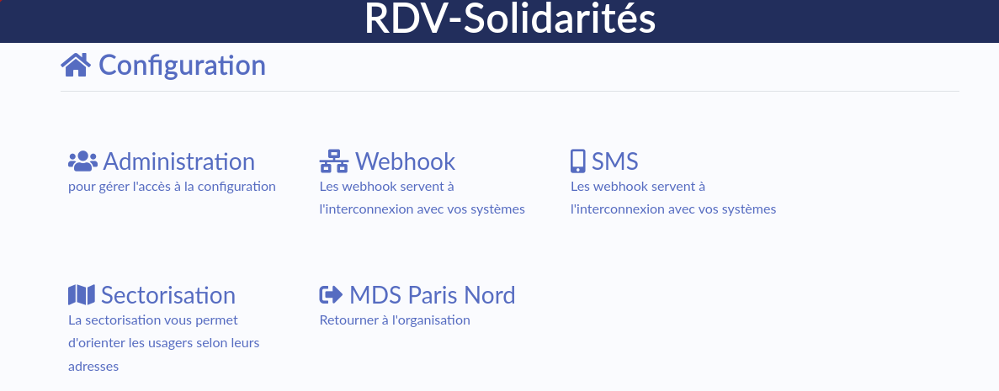

# Réunion référentes du 25 janvier 2022

### En production jeudi prochain

* [Clarifier le message de confirmation d'une annulation de RDV passée #1921](https://github.com/betagouv/rdv-solidarites.fr/issues/1921)

_Nous avons découvert deux bugs autour de cette modification, à reprendre avant la mise en production_

### Interface du module de configuration

Avant les divers manœuvres autour des éléments de configuration, nous avons voulu reprendre l'interface du module de configuration pour le simplifier. Le changement sera prêt à la mise en production d'ici à deux semaines peut-être.



### Recrutement en cours

L'équipe RDV-Solidarités va s'étoffer dans les semaines à venir. Doivent nous rejoindre

* Victor (développement) arrivé pour le 7 février. Mission : faire en sorte que les Conseillers numériques puissent utiliser RDV-Solidarités
* Matis (chargé de déploiement) arrivé pour le 28 février. Mission : trouver de nouveaux utilisateurs de RDV-solidarités
* Myriam (Chargé de relation utilisateur). Mission : Prendre soin des utilisateurs de RDV-Solidarités (usagers, professionnels…)

### Modification de RDV-Solidarités

> Est-ce que les modifications à venir sont obligatoire ?

Dans certains (tous ?) départements, l'arrivée d'un outil numérique tel que RDV-Solidarités, n'est pas sans accroc, sans difficultés. Difficile de changer sa façon de faire parfois. Difficile de s'approprier un outil.

**Cela nous** rappelle **à quel point l'expérience utilisateur est importante !** Et nous rappel également qu'il n'y a personne dans l'équipe aujourd'hui qui soit dédié à ce sujet. C'est probablement une réflexion à avoir pour les futurs recrutements ?

Nous rappelons qu'il serait très couteux (mais pas impossible) d'avoir une version figée pour un département...

Ça nous rappelle aussi qu'à une époque, l'équipe était en capacité de faire des formations aux agents. Nous avons dû arrêter par manque de temps. Avec ces nouveaux recrutements, nous avons peut-être l'opportunité de relance un peu cette dimension. Nous pourrions être plus présente dans la conduite du changement auprès des professionnels.

Sur Doctolib, des vidéos explicatives sont proposées aux utilisateurs lorsque de gros changement ont été apportés. Une idée pour nous ?

Maintenir la doc à jour, les tutoriels, l'aide en ligne... Avoir un système de chat pour répondre en direct aux problèmes ?

Avoir une newsletter ?

Ce sont là des pistes à discuter avec Myriam lorsqu'elle sera arrivée.

### Identification des personnes souvent absentes

Nous parlons d'une discussion qu'il y a eu par email à propos de l'identification des usagers ayant posé des lapins sur les derniers rendez-vous.

Lorsque l'on passe par la fiche usager pour prendre un RDV, c'est relativement visible par le biais des statistiques de RDV.

Si on passe par la recherche de créneau, la recherche de l'usager dans le tunnel de RDV ne propose pas cette visualisation.

Faut-il prévoir de ne passer que par un chemin ? Ça pourrait simplifier beaucoup de chose...

Sur Doctolib, il semblerait qu'il existe une notification visuelle dans le tunnel de prise de RDV pour alerter lorsqu'il y a eu un certain nombre de RDV précédent manqué.

Un autre point concerne l'aspect temporel qui n'est pas très visible sur le bloc de statistique aujourd'hui (cumul de notre sans notion de temps)



### Droits d'accès

Nous confirmons que nous allons maintenir des droits d'accès différent pour chaque organisation.

Pour faciliter la configuration de ces droits, nous souhaitons mettre en place des profils prédéfinis. Pour s'assurer que nous proposons les profils dont vous avez besoin, nous aimerions que vous remplissiez le tableau fourni par email en précisant le nom d'un profil et les droits associés. Il faudra également préciser si c'est un droit à définir par organisation ou bien global.

Fichier à récupérer à l'adresse [https://rdv-solidarites.github.io/droits-acces-rdv-solidarites.xls](https://rdv-solidarites.github.io/droits-acces-rdv-solidarites.xls)

### Notes

* Les paiements de 2022 peuvent-ils être déclenché ?
* Ça fait 2 semaines qu'il n'y a aucun SMS envoyé dans le 77 :scream:
* Il serait intéressant de pouvoir notifier des usagers après un rdv non honoré pour inviter à reprendre RDV (voir [https://github.com/betagouv/rdv-solidarites.fr/issues/1972](https://github.com/betagouv/rdv-solidarites.fr/issues/1972))
