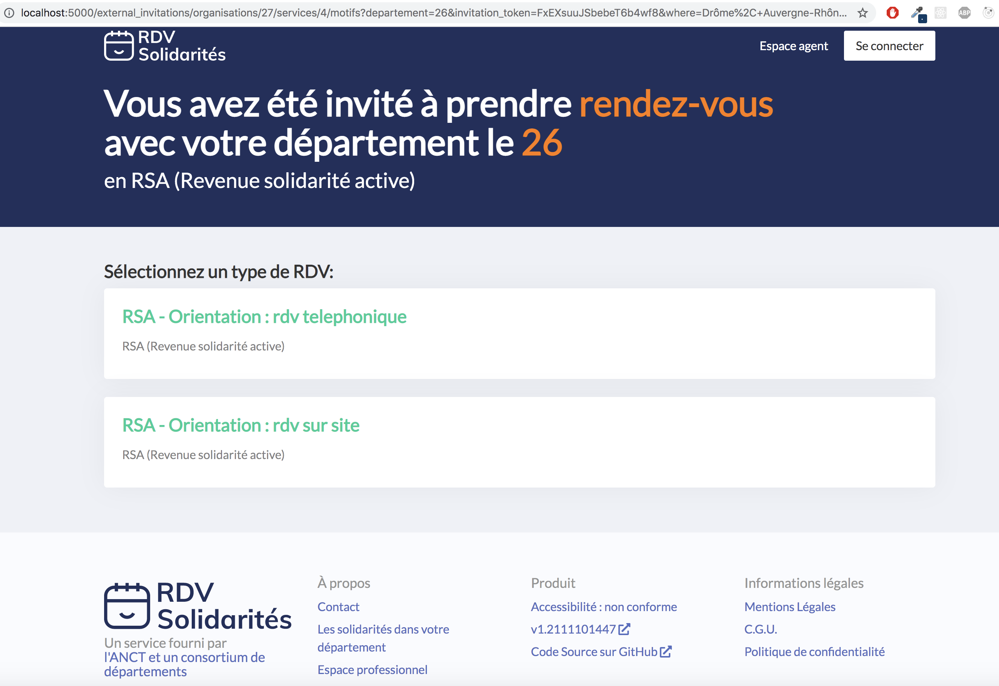
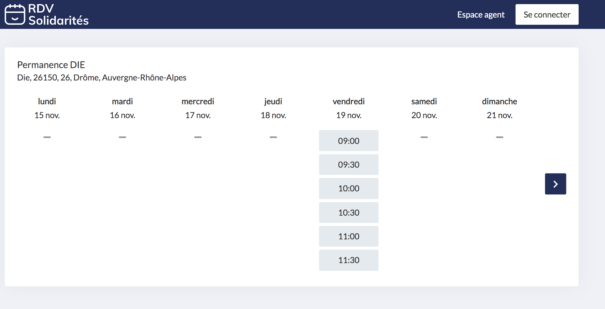

# Réunion référentes du 7 décembre 2021

### Problème de performance impactant l'agenda

Pour améliorer les performances, nous recalculons plusieurs éléments au moment de la mise à jour d'un RDV. Cela crée un déséquilibre sur d'autres partis de l'application.

Nous avons ajusté ce point dans la matinée.

Voir le ticket [Améliorer les performances de Rdv#update #1909 ](https://github.com/betagouv/rdv-solidarites.fr/issues/1909)pour plus de détail

### Problème sur les indisponibilités

Nous avons détecté que lors du calcul de créneaux actuel, nous prenons en considération toutes les absences, y compris celles qui sont passées.

Nous n'avions pas activé le traitement automatique des absences passées. Depuis que nous l'avons fait, nous avons découvert que ce traitement ne fonctionne pas exactement comme pour les plages d'ouverture puisqu'une absence à en plus une date de fin qui n'est pas lié à la date de fin de récurrence.

Cette erreur considère des absences en passées alors qu'elles sont encore active.

Nous avons amorcé une correction qui nécessite encore un ajustement. Cette correction sera mise en production dans la journée.

### Utilisation des indisponibilités

Nous avons profité de l'erreur sur les indisponibilités pour évoquer leurs usagers.

_L'hypothèse étant que les indisponibilités existe principalement pour palier au fait que nous ne pouvons pas intervenir sur une occurrence de plage d'ouverture en particulier_

Nous recueillons que les indisponibilités utilisées pour d'autres véhiculer informations :

* rappel pour penser à contacter telles personnes (80)
* pour avoir des plages de VAD pour les secrétaires (62)

Le classique restant d'utiliser une indisponibilité pour masque une partie de plage d'ouverture.

Il ne sera pas si simple de supprimer les indisponibilités. Et peut-être qu'une fois que nous pourrons manipuler les occurrences de plage d'ouverture, ça sera plus facile à imaginer.

### Finalité de RDV Solidarités

Notre discussion nous a amené à discuter des finalités de RDV-Solidarités. **Agenda ou prise RDV ?**

Comment aller vers une finalité qui n'est pas un agenda alors que l'on affiche un agenda ?

Pour provoquer un peu la discussion, nous avons imaginé supprimer la page agenda. C'est inimaginable aujourd'hui.

Difficulté de gestion de 3 agendas (Outlook, RDV et papier).

Pouvoir poser un RDV en dehors des plages reste important. Et le faire en dehors d'un agenda semble complexe. Il y a l'aspect « visualisation » de l'agenda qui semble important également.

Pour les CD, il est difficile d'aller sur l'ouverture

* à d'autres agents
* aux usagers et donc vers l'usager de plage d'ouverture.

Il y a alors à penser que les deux finalités sont à maintenir et à équilibrer.

### Interconnexions

Nous évoquons ensuite les interconnexions entrante et sortante.

Le lien étant que la plupart des interconnexions aujourd'hui sont avec le système d'agenda. Et puisque nous avons parlé de finalité Agenda... Maintenir 2 agendas semble un peu dommage.

La plupart des CD ont défini une ligne de conduite : RDV-Solidarités l'agenda pour poser des RDV avec les usagers, et Outlook (ou autre messagerie/agenda) pour ce qui est interne.

Quid des interconnexions pour créer automatiquement une indisponibilité dans RDV au moment où une réunion d'équipe est posé dans l'agenda pro ? Pour le moment rien de ce point de vue.

Il y a par contre la possibilité de créer des usagers via API. C'est utilisé par l'équipe Data.insertion. Ça pourrait l'être plus largement par les CD pour ne pas avoir à recréer des usagers alors qu'ils et elles sont déjà présent dans les logiciels métiers.

Il y a sans doute à refaire une communication claire sur les API entrantes et sortantes. D'autant que c'est sans doute un point fort de RDV-Solidarités qui va gagner en importance dans le futur.

Un petit rappel à l'occasion de cet échange

> Ne pas intégrer des fonctionnalités dans RDV si elle peuvent être traité via une interconnexion

Ne pas faire peser le choix de ne pas faire dans certains départements sur les épaules de l'équipe.

### Champ libre : remarque

Ce champ remarque, attaché à l'usager dans le contexte d'une organisation est un souci. Quel plan pour le supprimer ?

Le passer en lecture seul est un peu violent et non respectueux des utilisateurs.

Une rapide analyse à permis de conclure que ce champ est beaucoup utilisé pour

* mettre des compléments d'adresse
* préciser le numéro de dossier de l'application métier
* ajouter des numéros de téléphone de contact et préciser à qui est celui qui est renseigné

Nous pourrions faire une analyse plus poussée.

Le plan serait donc d'offrir une alternative pour ces champs et de voir ensuite.

### Contacts usager

Dans le cadre du champ remarque, nous avons parlé rapidement du [Passage du schema un usager à un responsable au schéma un usager à des contacts (notification multiple) #1670 ](https://github.com/betagouv/rdv-solidarites.fr/issues/1670). Nous avons sans doute à reprendre ce ticket. Il sera peut-être préférable d'avoir une liste de contact, déconnecté de la liste des usagers pour maintenir cette distinction entre les personnes à contacter et les personnes bénéficiaire.

### Libération des libellés de motif

Les noms de motifs sont maintenant libre. Vous pouvez mettre ce que vous voulez. Plus besoin de passer par une liste prédéfinie.

Cette modification a provoqué deux retours

> Nous essayons de les utiliser d'un site à l'autre afin d'harmoniser dans le département et surtout, nous regardons régulièrement la liste pour nous en inspirer (nous regardons également dans ceux des autres départements et en reprenons certains que nous trouvons intéressants). -- Christelle (64)

> Afin de ne pas créer des doublons, il serait préférable de garder la liste déroulante des motifsexistants. -- Marie (12)

Où il est évoqué l'harmonisation entre organisation. Nous avons un ticket sur le décloisonnement qui vise à déplacer le paramétrage des motifs en un point unique. Cela permettra de réduire le travail de paramétrage et facilitera l'harmonisation.

Pour l'inspiration, je dirais que chaque CD pourrait très bien communiquer aux autres ces choix en matières de motifs.

### Changement sur les étapes de recherche de créneau coté agent

Pour harmoniser le code et les interfaces, nous profitons d'une intervention sur l'affichage des créneaux coté agent pour modifier l'enchainement des écrans.

En effet, aujourd'hui, une fois les critères de recherche renseignée, nous affichons tous les créneaux regroupés dans un bloc par lieu. Alors que coté usager, une fois les critères renseigner, nous affichons les lieux qui proposent des créneaux et à quelle date pour le premier. Ensuite l'usager choisi un lieu et c'est seulement là que nous affichons les créneaux.

Nous envisageons de faire de même coté agent : afficher d'abord les lieux et la date du premier créneau pour chaque lieu, puis, pour un lieu seulement, tous les créneaux.

.png>)

### Parcours usager avec une invitation contextualisé

Ce n'est pour le moment pas une fonctionnalité configurable sur RDV-Solidarités. L'équipe de RDV-Insertion apporte une nouvelle possibilité dans RDV-Solidarités en permettant à des agents de lancer des invitations contextualisé, permettant ainsi de proposer à des usagers de venir prendre rendez-vous sur des motifs qui ne sont pas ouvert en ligne.

