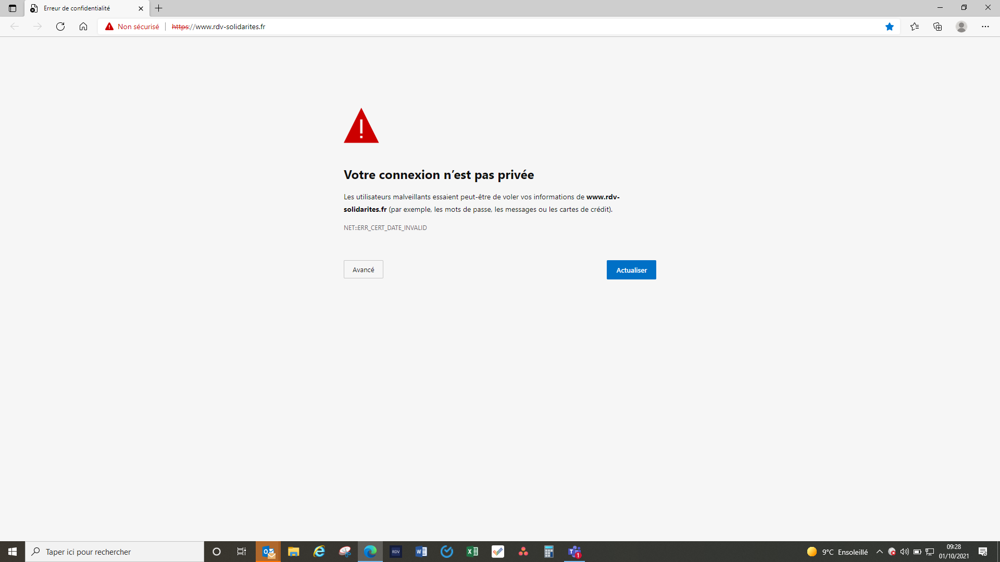

# Incident du 1er octobre 2021

### Chronologie

**9 h 28** : le département 64 nous signale l'impossibilité de se connecté à [https://rdv-solidarites.fr](https://rdv-solidarites.fr)  

**9 h 47** : l'équipe répons en utilisant la liste de diffusion pour avertir rapidement toutes les personnes référentes. Le problème est rapidement identifié, d'autant que la veille au soir un problème similaire a eu lieu sur le service Mon Suivi Justice.

**9 h 54** : Le département 80 nous signale qu'il n'y a pas de problème pour l'instant de leur côté.

**10 h 04** : Le département 77 signale quelques soucis de leurs côtés.

**10 h 06** : L'équipe, après avoir vérifié dans la communauté Beta.gouv, et tourné autour du problème plusieurs fois, décide de faire un email pour essayer d'expliquer clairement le souciet demande aux départements n'ayant pas accès à RDV-Solidarités de demander de l'aide à leur DSI.

### Le problème

Un morceau de la chaine qui permet de s'assurer que le tuyau entre le navigateur et le serveur de RDV-Solidarités est bien sécurisé n'était plus sûr. Il fallait le renouveler. Ça a été annoncé.

[DST Root CA X3 Expiration \(September 2021\)](https://letsencrypt.org/docs/dst-root-ca-x3-expiration-september-2021/)

Ce morceau était utilisé par beaucoup de site ! Ce problème ne concernait pas uniquement RDV-Solidarités.

La chose  à faire consistait à « accepter » la nouvelle chaine, celle avec le nouveau morceau.

[Let's Encrypt DST Root CA X3 expiry Sept 30th 2021 \| Certify The Web Docs](https://docs.certifytheweb.com/docs/kb/kb-202109-letsencrypt/)

Avec des navigateurs récent, mis à jour, il n'y a pas eu de coupure. Ce qui explique pourquoi l'équipe et certains \(beaucoup ?\) de département n'avait pas de problème.

C'est le fait que peu de département semblait avoir de problème et la dimension plus large que RDV-Solidarités qui nous ont amené à repousser le problème vers les DSI de chaque département concerné. 

### Leçon

Ce que nous aurions pu faire c'est s'assurer que les départements et leur DSI en particulier, avait conscience de cette expiration de certificat. Nous avons les moyens de savoir quels territoires utilise des navigateurs un peu anciens, pas forcément à jour.

Les prévenir en amont aurait peut-être permis à certaines DSI de préparer ces changements.

