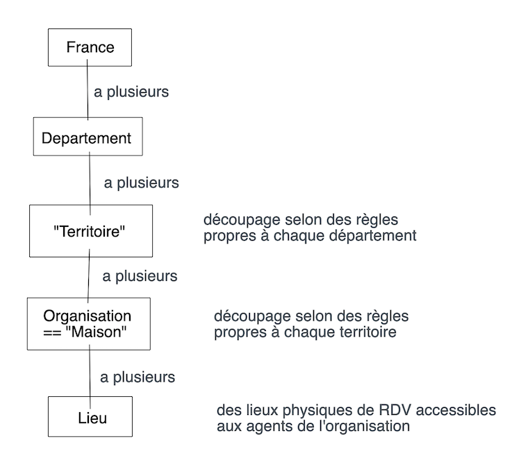

# Investigation - Sectorisation

Exemple de découpage dans le Pas de Calais :

[https://www.pasdecalais.fr/Le-Conseil-departemental/Les-services-departementaux/Les-Maisons-du-Departement/Les-Maisons-du-Departement-Solidarite-MDS](https://www.pasdecalais.fr/Le-Conseil-departemental/Les-services-departementaux/Les-Maisons-du-Departement/Les-Maisons-du-Departement-Solidarite-MDS)

* Il existe une MDS Territoire par Territoire \(par exemple une MDS Territoire Arrageois\). Elles ne sont pas répertoriées sur le site \(!\). Les MDS Territoires sont en charge de : Service RSA, Service personnes âgées/personnes en situation de handicap, aide sociale à l'enfance
* De plus, chaque Site a une "MDS Site" associée, par exemple Arras Sud a une MDS Arras Sud. Les MDS Site sont en charge de : PMI, social, éducatif

