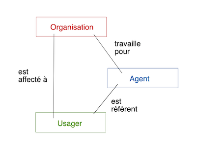

# Investigation - Liens agents, usagers et organisations

#### Cas 1

Réponse : non, ce cas ne devrait pas exister, c'est incohérent.

#### Cas 2

Réponse : oui, ce cas est possible. Il faudrait que l'usager ait un seul compte, mais toutes les infos de la fiche ne doivent pas être partagées entre les 2 organisations

#### Cas 3 :

Réponse : oui ce cas est possible et cohérent. La modélisation actuelle ne pose pas de soucis, il est clair que l'agent est référent de l'utilisateur uniquement dans le "contexte" de l'organisation concernée. Un agent a un rôle identique dans les différentes organisations auxquelles il est rattaché.

