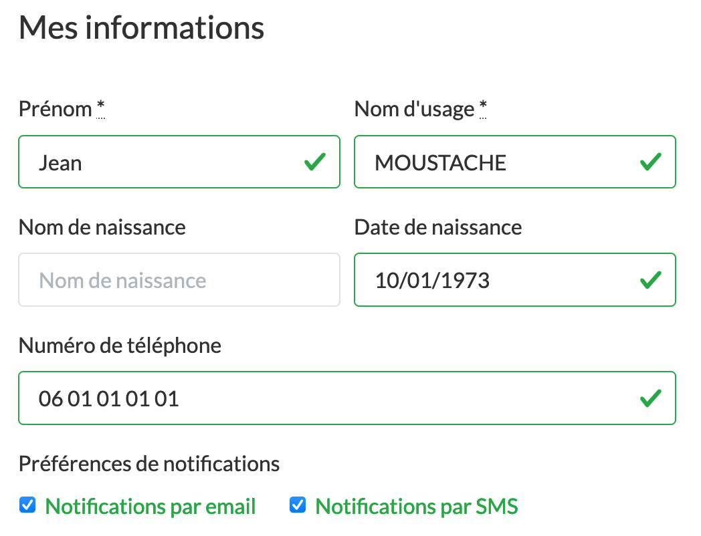
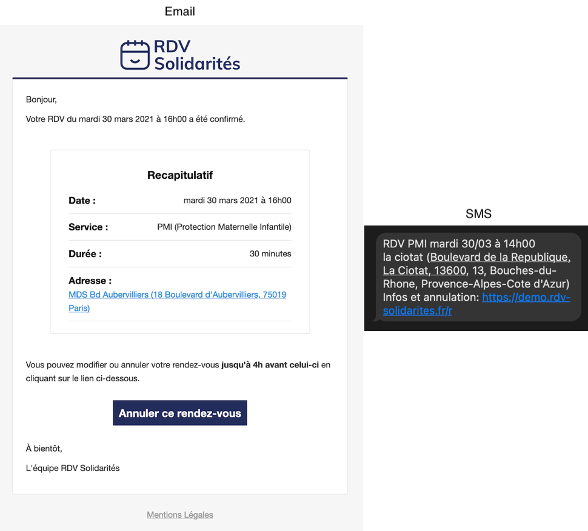

# Notifications usagers

## Préférences de notifications individuelles

Chaque usager est libre de choisir s'il souhaite recevoir des notifications par email et par SMS. Il peut configurer ces options dans son espace personnel. 

Une fois qu'un usager a modifié ses options personnelles, les agents ne peuvent plus les modifier, ses choix doivent être respectés. Cependant, si l'usager n'a encore jamais modifié lui-même ces options \(par exemple si c'est un compte usager qui vient d'être créé par l'agent\), elles peuvent être configurées par les agents.

## Notification initiale à la création du RDV

L'usager reçoit des notifications lorsqu'un agent vient de lui poser un RDV ou bien qu'il vient lui même de prendre RDV. Cette notification est envoyée sous la forme d'un SMS et d'un email.

## Rappels de RDVs

Des rappels de RDVs sont envoyés aux usagers **l'avant-veille à 9h**. Par exemple si un usager a un rendez-vous ce jeudi à 15h, il recevra une notification de rappel le mardi précédent à 9h.

Ces rappels sont aussi envoyés par email et par SMS, et leurs contenus sont très proches de ceux des notifications initiales.

