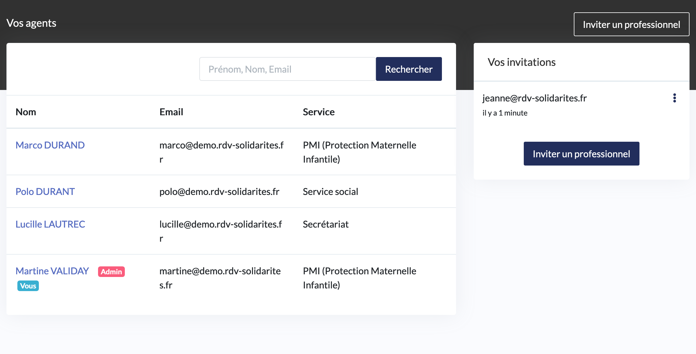
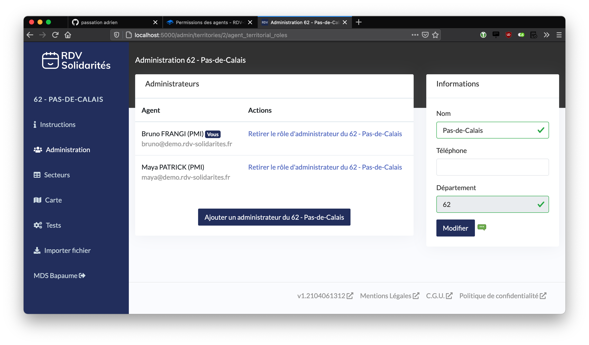

# Permissions des agents

## Rôles

Chaque agent a un rôle par organisation qui peut être **Utilisateur** ou **Administrateur**. Ces rôles ont des permissions différentes :

### Rôle Utilisateur

* Peut consulter et modifier son agenda \(RDVs, plages d'ouvertures, absences\)
* Peut consulter et modifier les agendas des autres agents de son propre service \(RDVs, plages d'ouvertures, absences\)
* Peut consulter et modifier les fiches usagers de l'organisation

### Rôle Administrateur

* Peut consulter et modifier l'agenda de tous les agents de l'organisation \(RDVs, plages d'ouvertures, absences\)
* Peut créer, modifier et supprimer des lieux, des motifs
* Peut inviter d'autres agents à joindre l'organisation
* Peut accéder aux statistiques de l'organisation


Un agent peut être Utilisateur dans une organisation mais Administrateur dans une autre organisation, les rôles sont indépendants.


### Cas particulier : Service Secrétariat

Les agents du service Secrétariat, même avec le rôle Utilisateur, bénéficient de permissions supplémentaires : 

* Peut consulter et modifier l'agenda de tous les agents de l'organisation \(RDVs, plages d'ouvertures, absences\)

Ils ne peuvent cependant pas créer et modifier des lieux, ni des motifs, ni inviter d'autres agents, ni modifier l'organisation ou la sectorisation etc...

## Administrateur Territoriaux


Pour l'instant, un territoire = un département. Plus tard, nous élargirons peut être cette notion pour permettre l'usage de RDV-Solidarités à d'autres échelles, par exemple des intercommunalités.


Un agent peut aussi posséder le rôle d'administrateur d'un ou plusieurs territoires entiers. Ce rôle donne des permissions spécifiques :

* Peut modifier les infos du territoire \(nom, numéro de téléphone\)
* Peut créer de nouvelles organisations
* Peut définir les règles de sectorisation
* Peut ajouter ou retirer d'autres agents comme administrateurs territoriaux

Ce rôle est indépendant des rôles par organisation décrits à la section précédente. Un agent peut être administrateur territorial mais pour autant n'être qu'un simple utilisateur dans certaines organisations.

## Invitations

Seul les agents Administrateurs d'organisation peuvent inviter d'autres agents.

Lors de l'invitation, seul un e-mail et un rôle vous sont demandés. L'invité recevra alors un mail avec un lien qui lui permettra de définir son nom et prénom ainsi que son mot de passe.

L'invitation se fait à l'échelle d'une organisation. Si vous souhaitez inviter un agent dans plusieurs organisations, il faudra répéter cette manipulation. Cependant, une fois que l'agent possède un compte, l'invitation n'aura plus besoin d'être validée : l'agent ne recevra pas de mail et sera automatiquement ajouté. 

## Retrait d'un agent d'une organisation

Seuls les agents Administrateurs d'organisation peuvent retirer d'autres agents \(Administrateurs ou non\) de l'organisation.

Un agent ne peut pas être retiré d'une organisation s'il a des RDVs non-annulés à venir. Il faudra les annuler ou les réassigner préalablement.

Le retrait d'un agent d'une organisation supprimera de manière irréversible toutes ses plages d'ouvertures et ses absences configurées dans cette organisation. 

Le retrait d'un agent ne supprime pas son compte. S'il a accès à d'autres organisations, il pourra toujours y accéder. S'il n'a plus accès à aucune organisation, il pourra toujours se connecter mais accèdera à une interface vide où il pourra uniquement configurer ou supprimer son compte.

