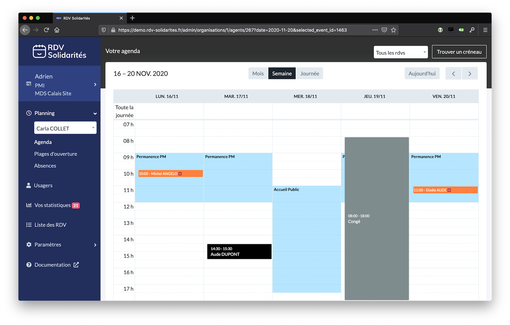
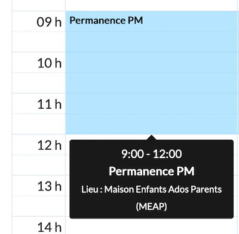
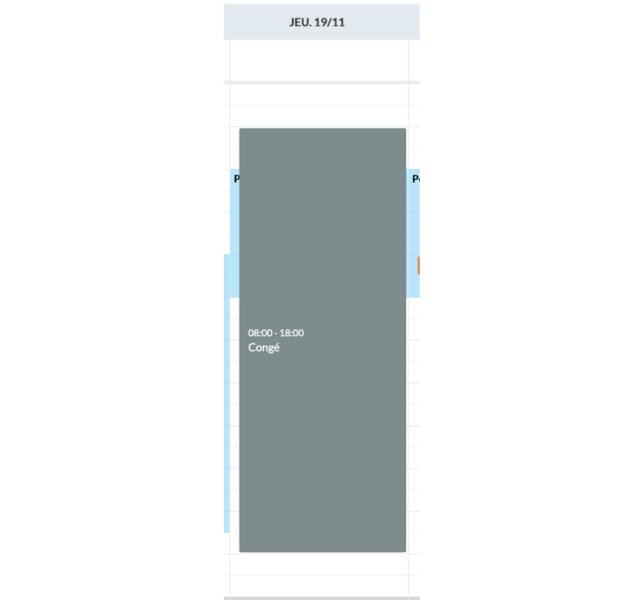

# Interface Agent

## Vue Agenda d'un agent

## Rendez-vous

Les rendez-vous peuvent réunir plusieurs usagers, souvent des responsables et leurs proches. Ils peuvent aussi être attribués à plusieurs agents.

Chaque RDV a un statut qui évolue parmi ces différentes valeurs : 

* À venir
* À renseigner
* En salle d'attente
* Vu
* Absent excusé
* Absent non excusé

## Plages d'ouvertures

Les plages d'ouvertures décrivent les créneaux disponibles à la prise de RDV des agents. Une plage d'ouverture peut être exceptionnelle \(un jour précis\) ou bien récurrente \(par exemple tous les jours de la semaine\). Chaque plage d'ouverture est associée à un ou plusieurs motifs.  Un agent peut avoir autant de plages d'ouvertures que nécessaire.

Les usagers cherchant à prendre RDV en ligne verront des créneaux proposés en fonction des plages d'ouvertures des agents. Par contre, les agents peuvent poser des RDVs en dehors des plages d'ouvertures. 

## Absences

Les absences permettent de définir des indisponibilités exceptionnelles des agents. Par exemple, un agent pourra créer une absence pour signaler ses congés, plutôt que supprimer toutes ses plages d'ouvertures pour les re-créer à son retour.

Les absences peuvent aussi être définies de manière récurrente, par exemple pour préciser qu'un agent est absent tous les mercredis après-midi.

## Motifs

Un motif est un modèle de RDV, il représente un type de RDV. Chaque motif a un nom et une durée par défaut. 

Un motif peut être marqué comme disponible à la réservation en ligne par les usagers ou non.

Les motifs sont indépendants entre services.

