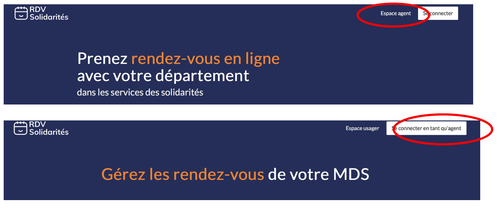
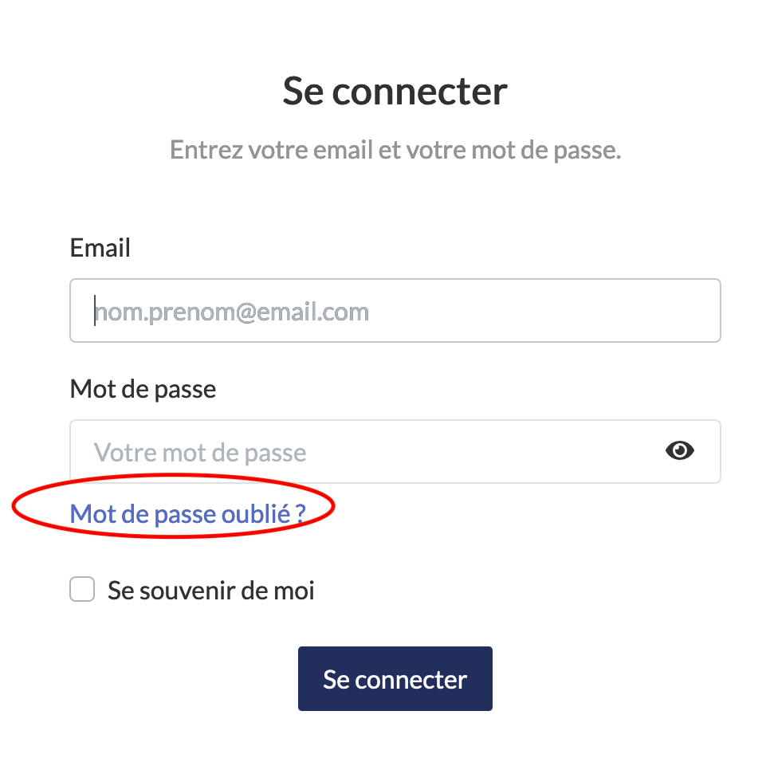

# Etape 0 : Comment se connecter ?

### J’ai déjà un compte

Rendez-vous sur cette page : [https://www.rdv-solidarites.fr](https://www.rdv-solidarites.fr)

* Cliquez sur « Espace agent » en haut de page à droite
* Cliquez sur « Se connecter en tant qu’agent » en haut de page à droite
* Authentifiez-vous avec votre email et mot de passe

### J’ai oublié mon mot de passe 

* Cliquez sur « Mot de passe oublié »
* Renseignez votre adresse email
* Un email vous a été envoyé, ouvrez-le et cliquez sur le lien
* Créez un nouveau mot de passe

### Mon adresse email n’est pas reconnue

Plusieurs possibilités : Vous n’avez pas activé votre compte dans les temps ou vous n’avez pas encore été invité.

* Cliquez sur le bouton « Renvoyer » puis ouvrez l’email d’invitation
* cliquez sur le lien présenté dans l’email 
* créez votre mot de passe

