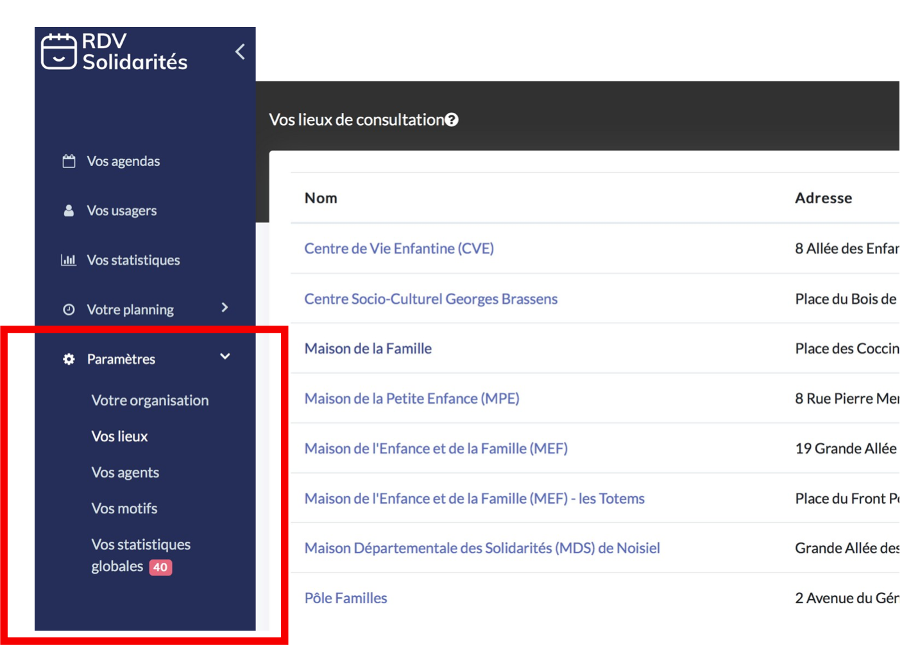

# Étape 1 : Effectuer le paramétrage


Ils peuvent être modifiés à tout moment d’utilisation de l’outil. Seuls les agents possédant le profil « administrateur » ont l’accès aux paramètres.












