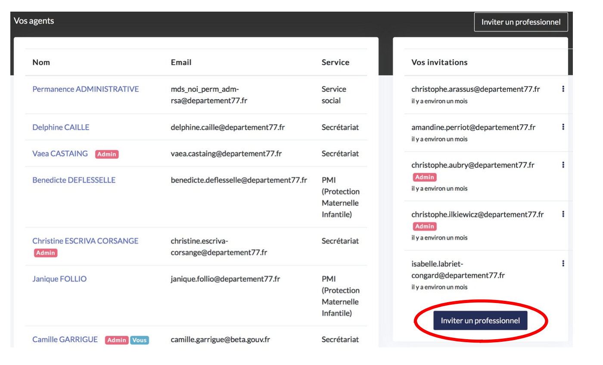
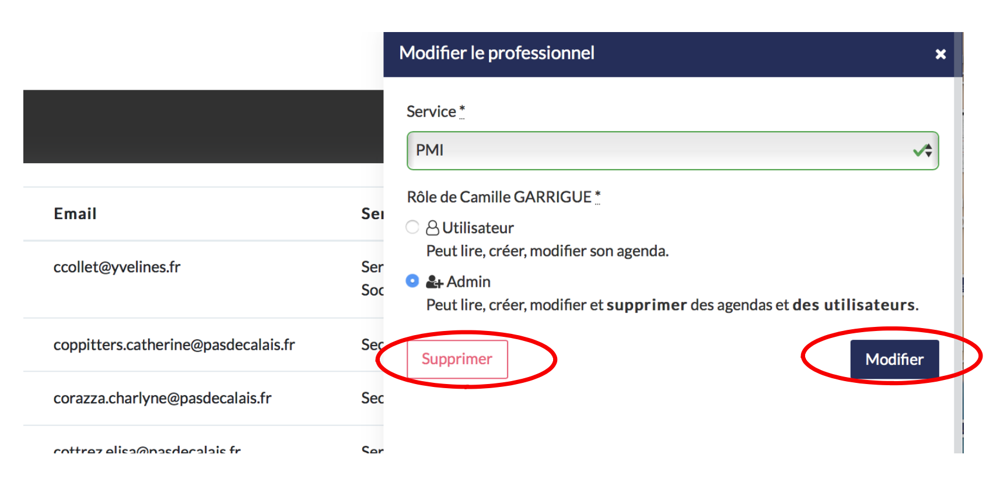

# Vos agents

## Comment inviter un professionnel à rejoindre l’outil ?

* Cliquez sur « invitez un professionnel »
* Renseignez son adresse email
* Choisissiez le service auquel appartient cet agent : PMI, service social ou secrétariat
* Attribuez-lui un rôle :
  * Administrateur : vous lui permettez d’accéder aux paramètres. Il a accès à tous les agendas en lecture et modification.
  * Utilisateur : il n’a pas accès aux paramètres et a accès uniquement aux agendas des agents de son service.

A savoir : tous les agents du service secrétariat ont aussi accès à l’ensemble des agendas et lecture et modification.

### Comment modifier le rôle d’un professionnel ?

* Cliquez sur le nom de l’agent
* Changez le rôle
* Cliquez sur « modifier »

### Comment supprimer un professionnel ?

* Cliquez sur le nom de l’agent
* Cliquez sur « supprimer » dans le bandeau s’affichant à droite

## 

