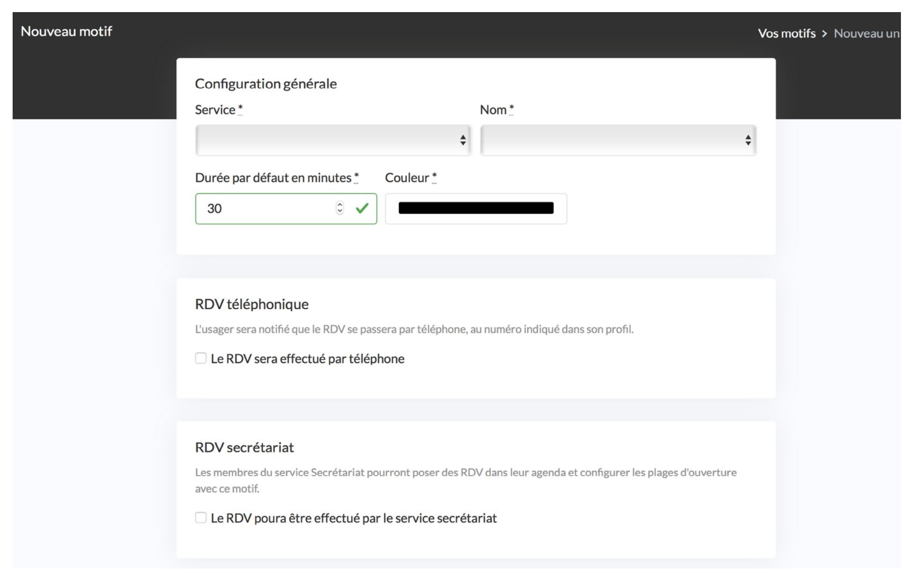

# Vos motifs

### **Comment créer un motif ?**

* Cliquez sur « créer un motif »

### Configuration générale :

1. Choisissez le service concerné
2. Choisissez un nom dans la liste proposée. Si le motif que vous souhaitez créer n’est pas compris dans ce référentiel adressez-vous à l’équipe RDV-solidarités afin qu’il y soit ajouté.
3. Choisissez une durée par défaut du RDV. Cette durée permet de proposer des créneaux au usagers pour la prise de RDV en ligne. En revanche si c’est le professionnel qui pose le RDV, la durée du RDV peut être modifiée.
4. Choisissez une couleur associée à ce motif. Les RDV de ce motif apparaitront dans la couleur choisie sur le calendrier.

### Type de RDV

* Choisissez le type de RDV adapté :
  * Sur place : c’est un RDV en présentiel qui aura lieu au lieu sélectionné
  * Par téléphone : L'usager sera notifié que le RDV se passera par téléphone, au numéro indiqué dans son profil.
  * A domicile : L'usager sera notifié que le RDV aura lieu à l'adresse remplie dans son profil.

### RDV de suivi

Cochez cette case si vous souhaitez que le motif soit réservé aux usagers bénéficiant d’un accompagnement et pour lesquels on a nommé un référent sur leur fiche usager. Les motifs « RDV de suivi » permettent à l’usager d’accéder uniquement aux disponibilités de son agent référent lors de la prise de RDV en ligne.

### RDV secrétariat

* Si le motif de RDV peut être effectué par un agent du secrétariat, alors cochez la case « Le RDV pourra être effectué par le service secrétariat »

  N.B : Si c’est un RDV de type « A domicile » alors il est impossible de cocher cette case, l’option apparaitra grisée.

### Prise de RDV en ligne par les usagers

* Si vous souhaitez permettre aux usagers de prendre RDV en ligne pour ce motif, alors cochez « RDV en ligne ». Si vous souhaitez que seuls les agents posent les RDV alors laissez la case « non-cochée\).
* Délai minimum de réservation : choisissez le délai minimum que vous autorisez à l’usager pour la prise de RDV en ligne. Par exemple 1 heure, l’usager verra les créneaux disponibles jusqu’à une heure avant le RDV.
* Délai maximum de réservation : choisissez le délai maximum que vous autorisez l’usager pour la prise de RDV en ligne. Par exemple 3 moi, l’usager verra tous les créneaux disponibles sur les trois prochains mois.

### Notifications des usagers par email et SMS

* Notification des usagers par email et par SMS : cochez si vous souhaitez désactiver toutes les notifications aux usagers pour les RDV de ce motif.

### Instructions

* Instructions : ajoutez des instructions afin de donner des informations personnalisées aux usagers lors de la prise de RDV en ligne.
  * « Instructions à accepter avant la prise du rendez-vous » : elles apparaissent avant la confirmation du RDV par l’usager.
  * « Indications affichées après la confirmation du rendez-vous» : elles apparaissent sur la page de confirmation et sur l’email de confirmation envoyé à l’usager.

Une fois toutes ces informations renseignées cliquez sur « créer ».

Le motif apparait désormais dans votre liste.

