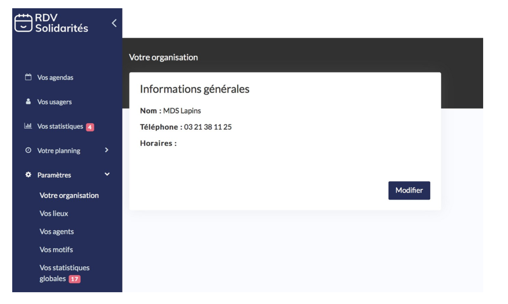

# Votre organisation

Ces informations apparaissent à l’usager lorsque celui-ci cherche à prendre RDV dans votre département et qu’aucune consultation n’est proposée à la prise de RDV en ligne. Ainsi l’usager à toujours le moyen de contacter le service.

## 

