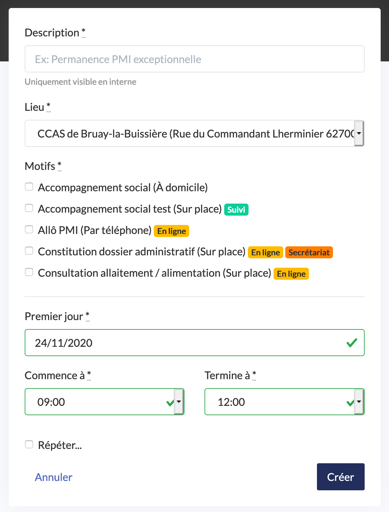
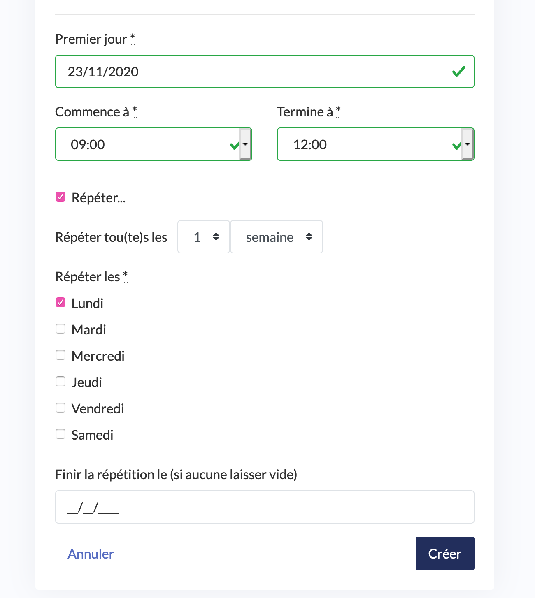

# Créer des plages d’ouverture

## Pourquoi déclarer des plages d'ouverture ?

Déclarer des plages d’ouverture est utile pour deux choses :

* la prise de rendez-vous en ligne afin de mettre des créneaux de RDV à disposition des usagers.
* La pose de RDV par le secrétariat afin qu’il ait connaissance de vos disponibilités.

## Comment créer une plage d'ouverture ?

Un onglet dédié vous permet de déclarer des moments où vous êtes disponibles pour recevoir des usagers pour certains motifs et sur certains lieux. Comment créer une plage d’ouverture ?

* Cliquez sur « Créer une plage d’ouverture »
* Renseignez le nom de la plage d’ouverture. Par exemple : « consultation de PMI », « permanence sociale ».
* Lieu : choisissez un lieu où les consultations seront réalisées parmi la liste proposée
* Premier jour : date à laquelle commence cette plage d’ouverture
* « Commence à », « termine à » : précisez les horaires de cette plage d’ouverture.
* Motifs : cochez tous les motifs de consultations traités sur cette plage d’ouverture. Vous pouvez en sélectionner autant que vous le souhaitez.

* « Répéter la plage d’ouverture… » : en cochant cette case vous avez la possibilité plage d’ouverture Cliquez sur « créer » afin d’enregistrer la plage d’ouverture.

Elle s’affiche désormais dans la liste.

