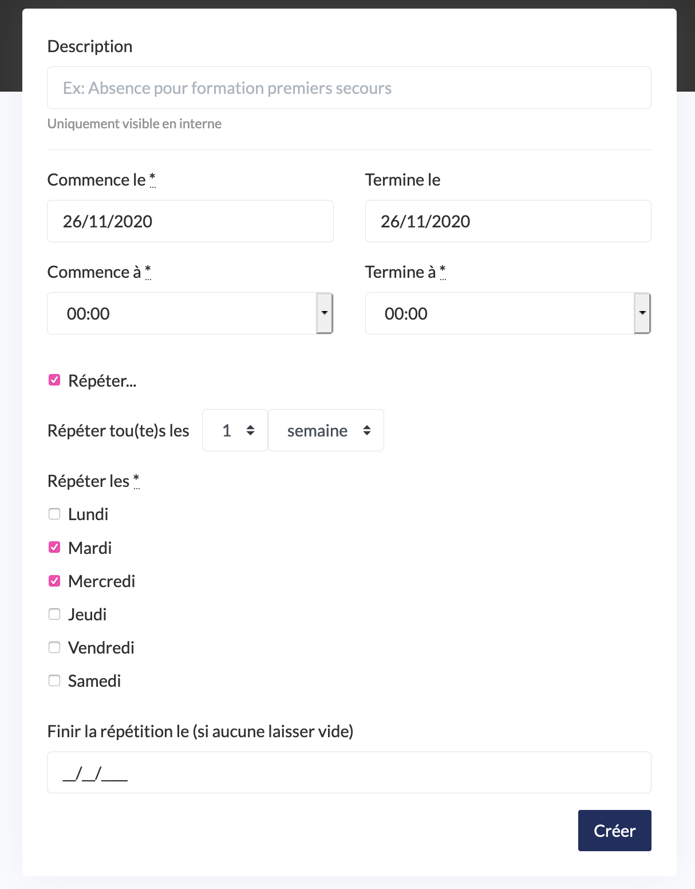

# Créer et gérer les absences

Vous avez la possibilité de déclarer une absence afin que l’outil retire vos disponibilités dans la prise de rendez-vous en ligne et pour rendre l’absence visible sur votre calendrier.

## **Comment créer une absence ?**

* Cliquez sur « créer une absence »
* Donnez un nom à cette absence dans « nom ». Vous pouvez par exemple écrire le motif de l’absence ou simplement écrire « absence » si vous ne souhaitez pas renseigner de motif.
* Donner le début et la fin de votre absence dans « commence à » et « Termine à ».
* « Répéter… » : cette case vous donne la possibilité d d’ajouter une récurrence à cette absence par semaine et jours de la semaine et de définir une date de fin de cette récurrence.
* Cliquez sur « créer »

Votre absence s’affiche maintenant dans la liste et est visible sur votre calendrier.

## **Comment supprimer une absence ?**

* Cliquez sur le nom de l’absence dans la liste
* Cliquez sur « supprimer »
* Confirmez la suppression

## **Comment modifier une absence ?**

* Cliquez sur le nom de l’absence dans la liste
* Effectuez les modifications nécessaires
* Cliquez sur « modifier »

