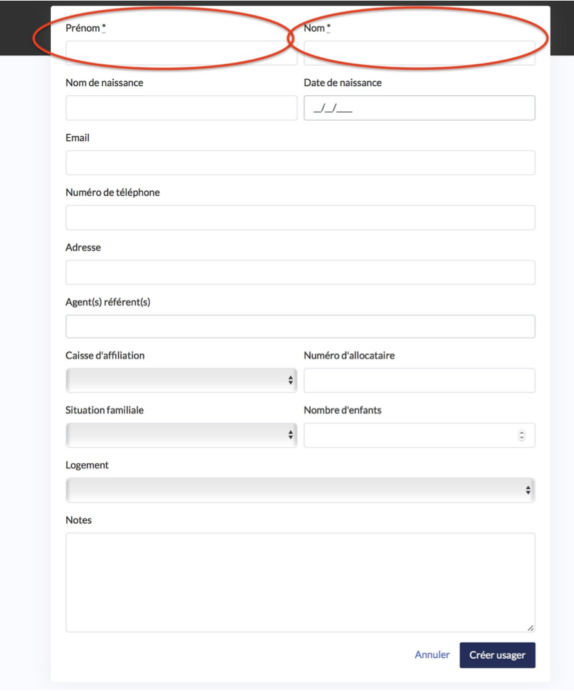

# Comment créer une fiche usager en charge ?

Cliquez sur « créer un usager » en haut à droite de la page et en bas de page.

* Renseignez les informations sur l’usager. Les deux seules informations obligatoires sont le Nom et le Prénom de l’usager.
* Cliquez sur « créer »

La fiche usager apparait désormais dans la liste.

N.B le champs « Agent\(s\) référent\(s\) » permet d’inscrire l’usager dans une démarche d’accompagnement en lui attribuant un ou plusieurs agents référents. Inscrire un agent référent permet deux choses :

* Permettre aux autres agents notamment le secrétariat de connaitre l’agent en charge de l’accompagnement afin qu’ils puissent vous poser un RDV avec cet usager.
* S’il existe un motif de type « RDV de suivi » ouvert en ligne cela permet à l’usager de n’avoir accès qu’aux disponibilités de l’agent référent.

