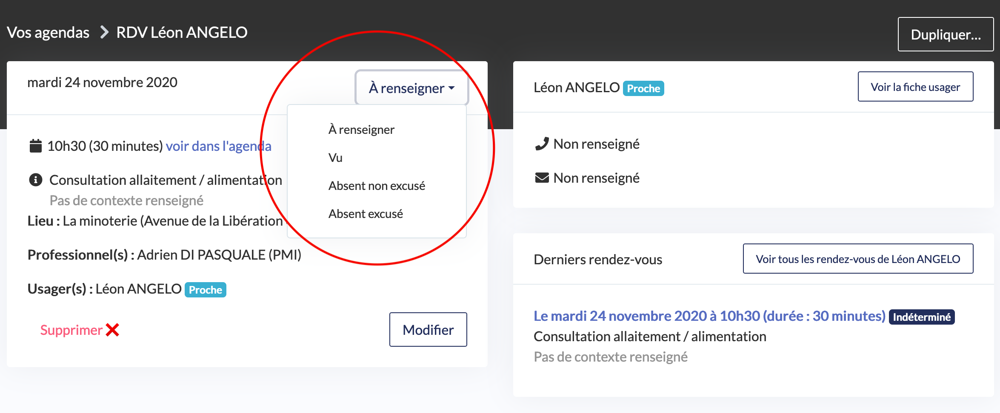
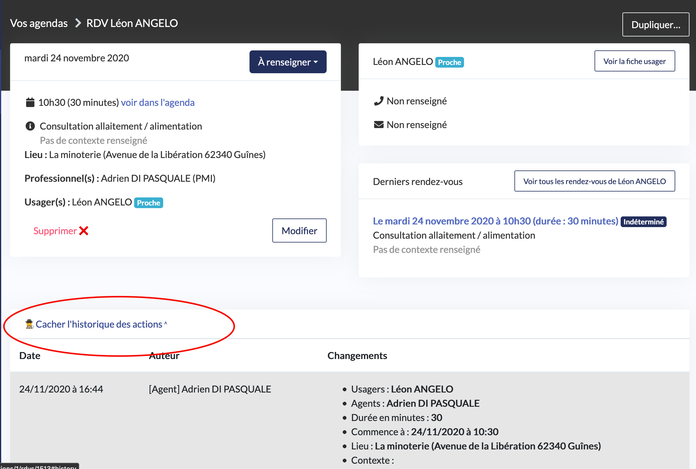

# Comment consulter et modifier le résumé d’un rendez-vous ?

Recherchez le rendez-vous en naviguant sur le calendrier

* Cliquez sur le créneau du rendez-vous
* Le résumé s’affiche sur une nouvelle page

## Comment supprimer un rendez-vous ?

* Dans le résumé du rendez-vous, cliquez sur « supprimer »
* Confirmez la suppression

  Le RDV disparait de l’agenda et des statistiques. Dans le cas d’une annulation veuillez utiliser les statuts « Absent excusé » ou « Absent non excusé ».

  La suppression du rendez-vous n’est pas notifiée à l’usager de manière automatique. Il vous faut avertir l’usager et reprogrammer un rendez-vous avec lui.

## Comment modifier un rendez-vous ?

* Dans le résumé du rendez-vous, effectuez les modifications nécessaires
* Cliquez sur « modifier »

La modification du rendez-vous n’est pas notifiée à l’usager de manière automatique. Il vous faut avertir l’usager afin de l’en avertir.

## Comment attribuer un statut au rendez-vous ?

Cette action est importante afin de tenir des statistiques de prise de rendez-vous à jour.

* Dans le résumé du rendez-vous, cliquez sur le statut adéquat :
  * Indéterminé : statut par défaut attribué aux rendez-vous à venir
  * En salle d’attente : le secrétariat notifie que l’usager est arrivé sur le lieu
  * Vu : l’agent notifie que l’usager était bien présent au rendez-vous
  * Absent excusé : l’usager a annulé son rendez-vous
  * Absent non-excusé : l’usager a posé un lapin
* Cliquez sur « modifier »

Le changement de statut est maintenant pris en compte.

## Comment consulter l’historique des actions du RDV

Cet historique vous permet d’avoir accès à toutes les actions réalisées par les agents et/ou les usagers pour ce RDV.

* Cliquez sur « Afficher l’historique des actions »
* L’historique apparait en bas de page

## 

