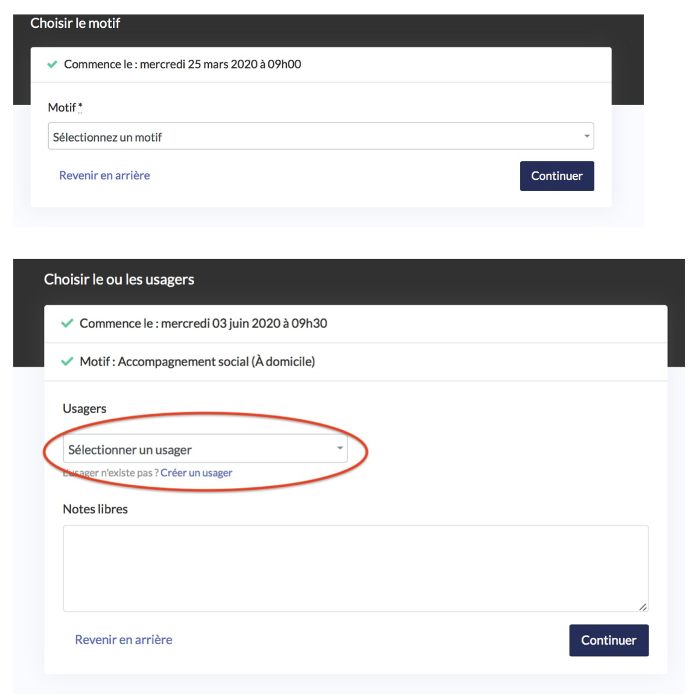
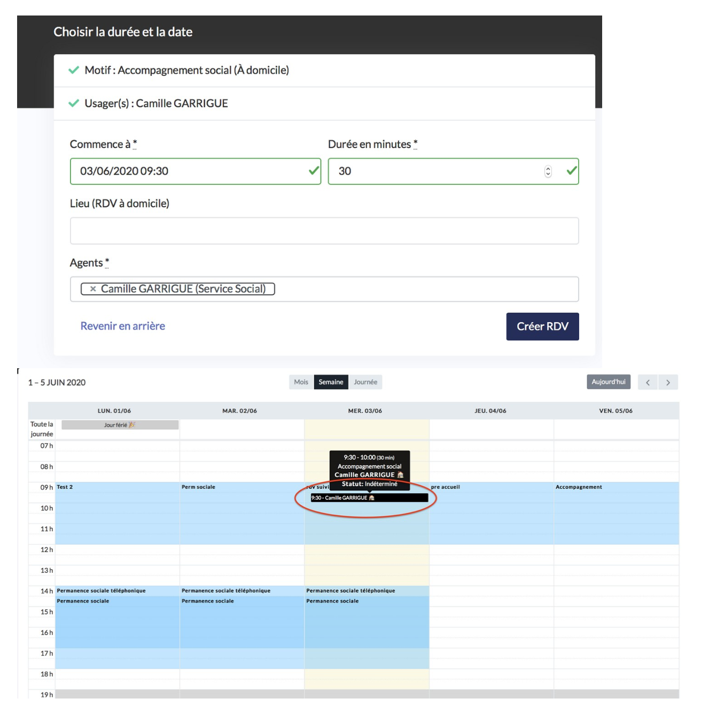

# 1. Directement sur l’agenda de l’agent

Cliquez sur un créneau

* Choisissez le motif du rendez-vous
* Cliquez sur « continuer »
* Cliquez dans la barre de recherche « usagers » et commencez à taper le prénom ou le nom de l’usager jusqu’à ce que l’usager apparaisse dans la liste et cliquez sur l’usager recherché. Son nom apparait désormais dans la barre « usagers ». S’il s’agit d’un nouvel usager alors cliquez sur « Créer un usager », remplissez la fiche et cliquez sur « créer usager ».
* Ajoutez des notes libres concernant le RDV permettant de le contextualiser
* Cliquez sur « continuer »
* Vérifiez ou modifiez la date, l’horaire et la durée proposée
* Sélectionnez un lieu dans la liste proposée
* Cliquez dans la barre de recherche « agents » afin de sélectionner le ou les agents qui effectueront le rendez-vous.
* Cliquez sur « Créer RDV »

Le rendez-vous apparait désormais dans le calendrier.

\*\*\*\*

