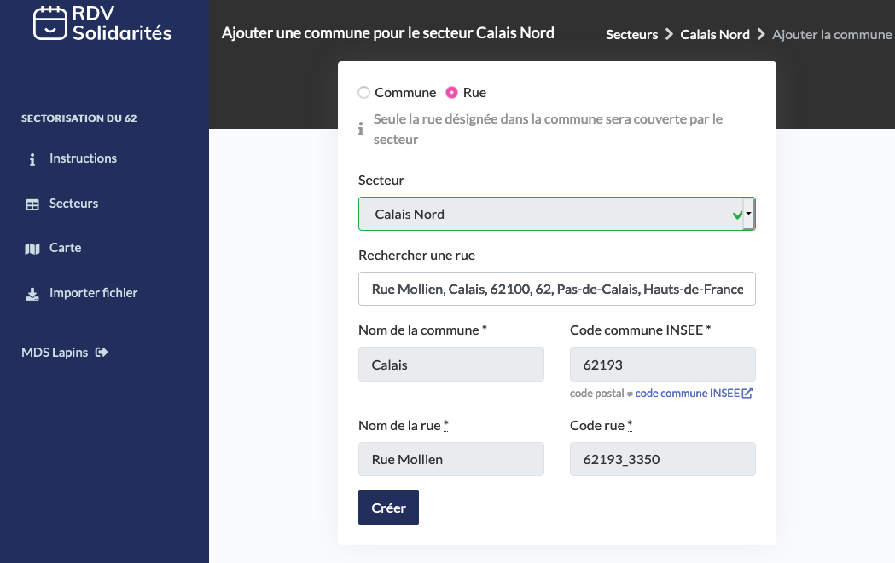

# Exemple 2 : Sectorisation par rue et par agent

RDV-Solidarités supporte l'échelle géographique de la rue ou de la commune entière pour vous permettre d'assigner les usagers aux bons agents.

## Exemple

Cet exemple décrit la configuration à utiliser pour découper la ville de Calais en 2 : une zone Nord qui sera gérée par l'agent Thomas et une zone Sud qui sera gérée par l'agent Adrien. 

L'idée est de créer 3 secteurs : 

* Zone Calais Sud : définie par un ensemble de villes attribuées à l'agent Thomas
* Zone Calais Nord : définie par un ensemble de villes attribuées à l'agent Adrien

### Captures d'écran de la configuration

### Import d'un fichier de rues

Renseigner manuellement les rues de chaque secteur peut être fastidieux. Si vous disposez déjà d'un fichier de rues pour chaque secteur, vous pouvez utiliser l'interface d'import de fichier. 

Note : votre fichier doit comporter les identifiants de rues de la [Base d'Adresses Nationale](https://adresse.data.gouv.fr/) . Vous pouvez utiliser [cet outil externe](https://adresse.data.gouv.fr/csv) pour vous aider à trouver ces identifiants.

