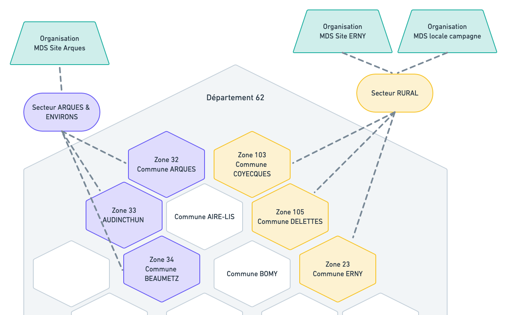

# Sectorisation géographique

## Fonctionnement

La sectorisation permet d’attribuer des secteurs géographiques à des organisations. Un usager est orienté vers les organisations dont il dépend en fonction de l'adresse saisie lors de sa prise de RDV en ligne

Chaque Secteur est défini comme un ensemble de communes ou de rues.

Un Secteur est attribué à une ou plusieurs Organisations entières ou bien à un ou plusieurs Agents spécifiques désignés.

Seuls les Agents avec le rôle Administrateur peuvent configurer la sectorisation des organisations qu’ils administrent. Néanmoins, ils ont la visibilité sur l’ensemble des Secteurs du Département.

## Exemples

**Cas 1. un usager cherche dans la commune AUDICTHUN**

* Une Zone correspondant à cette commune est trouvée : la Zone 33.
* Le Secteur "ARQUES & ENVIRONS" associé à cette Zone est attribué à 1 Organisation
* Les RDVs proposés à l'usager seront donc ceux disponibles dans l'Organisation "MDS Site Arques"

**Cas 2. un usager cherche dans la commune DELETTES**

* Une Zone correspondant à cette commune est trouvée : la Zone 105.
* Le Secteur "RURAL" associé à cette Zone est attribué à 2 Organisations
* Les RDVs proposés à l'usager seront donc ceux disponibles dans ces deux Organisations "MDS Site ERNY" et "MDS locale campagne"

**Cas 3. un usager cherche dans la commune BOMY**

* Aucune Zone n'est associée à cette commune, donc aucun Secteur, ni aucune Organisation
* Aucun RDV ne sera donc proposé à cet usager, il lui sera indiqué que la prise de RDV en ligne n'est pas disponible à son adresse.

