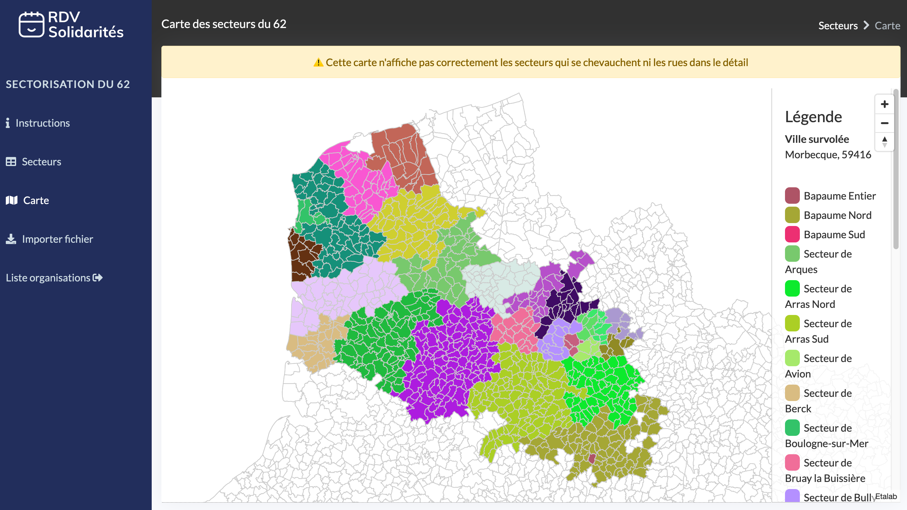
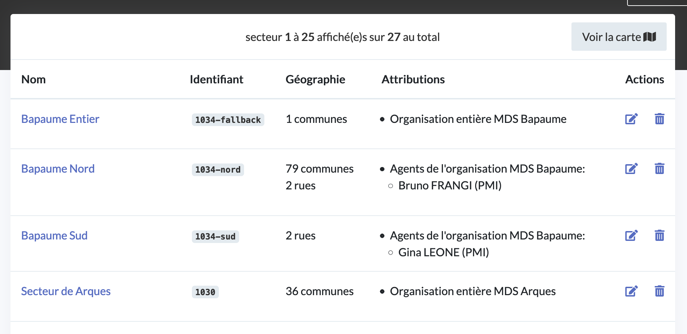
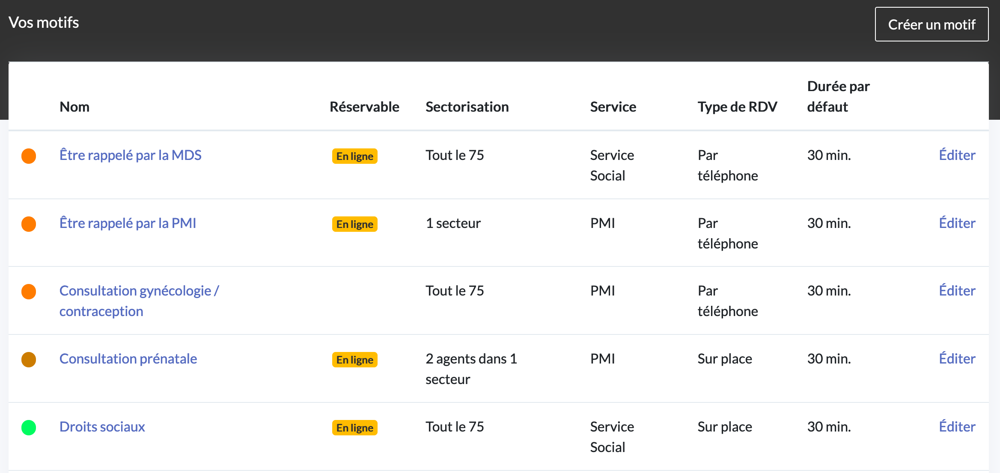

# Sectorisation géographique

## Fonctionnement

La sectorisation permet de définir des secteurs géographiques et de leur attribuer des responsables. Les usagers sont orientés vers les bons responsables selon l'adresse saisie lors de leur prise de RDV en ligne.

### Secteurs

Chaque secteur est défini comme un ensemble de communes ou de rues.

Chaque secteur est attribué à une ou plusieurs organisations entières ou bien à un ou plusieurs agents spécifiques.

### Motifs

Chaque motif a un niveau de sectorisation propre parmi les trois possibles : 

* **niveau département** : les créneaux pour ce motif apparaîtront pour les recherches d'usagers depuis l'ensemble du département
* **niveau organisation** : les créneaux pour ce motif apparaîtront pour les recherches d'usagers couvertes par des secteurs attribués à des organisations entières
* **niveau agent** : les créneaux pour ce motif apparaîtront pour les recherches d'usagers couvertes par des secteurs attribués à des agents spécifiques

### Possibilités

Ce système de secteurs et de motifs permet de répondre à des cas d'usages variés :

* Définir des groupes de communes dans un département et attribuer chaque groupe à une organisation différente 
* Définir certains motifs exceptionnels qui contournent cette sectorisation et peuvent être réservés depuis tout le département

ou encore :

* Découper une commune en plusieurs quartiers et assigner des agents à chaque quartier sur les motifs de la PMI
* Définir un motif exceptionnel dans la PMI qui contourne cette sectorisation et permet aux usagers de réserver depuis toute cette commune, voire depuis tout le département

### Configuration et permissions

Les agents n'ayant pas le rôle Administrateur ne peuvent configurer ni les motifs ni les secteurs.

Les agents avec le rôle Administrateur peuvent configurer les secteurs de leurs organisations uniquement. Ces agents voient les secteurs des autres organisations du département; mais ne peuvent pas les éditer

## Plus en détail







