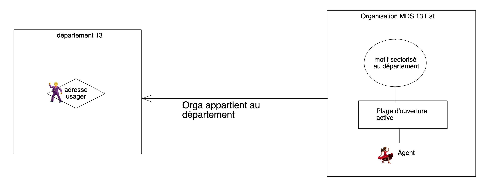

# Logique détaillée de la sectorisation

### Recherches usagers

Lorsqu'une personne fait une recherche sur RDV-Solidarités, elle renseigne son adresse et des motifs et des créneaux lui sont proposés. 

La présence d'un motif dans la liste dépend de l'adresse et des règles de sectorisation. Il y a plusieurs cas possibles, voir la section suivante.

La présence d'un motif dans cette liste dépend aussi de conditions indépendantes de l'adresse :

* qu'un agent ait une plage d'ouverture active contenant ce motif \(active = qu'il y ait des occurences à venir\).
* que ce motif soit marqué "réservable en ligne"

### Combinaisons possibles pour la présence d'un motif

#### Cas 1. Sectorisation au département

#### Cas 2. Sectorisation à la commune et à l'organisation

#### Cas 3. Sectorisation à la commune et à l'agent

#### Cas 4. Sectorisation à la rue et à l'organisation

Schéma à venir

#### Cas 5. Sectorisation à la rue et à l'agent

Schéma à venir

