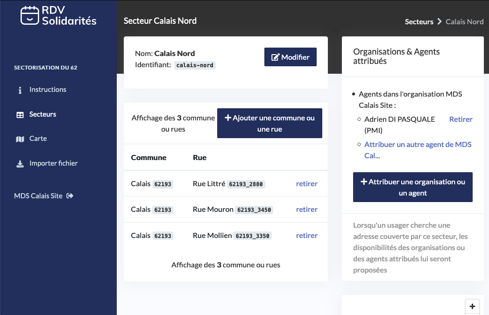

# Sectorisation par rue et par agent

RDV-Solidarités supporte l'échelle géographique de la rue ou de la commune entière pour vous permettre d'assigner les usagers aux bons agents.


Cette page est en cours de refonte; une partie des informations n'est plus à jour


## Exemple

Cet exemple décrit la configuration à utiliser pour découper la ville de Calais en 2 : une zone Nord qui sera gérée par l'agent Thomas et une zone Sud qui sera gérée par l'agent Adrien. 

L'idée est de créer 3 secteurs : 

* Zone Calais Sud : définie par un ensemble de villes attribuées à l'agent Thomas
* Zone Calais Nord : définie par un ensemble de villes attribuées à l'agent Adrien
* Zone Calais Repli : définie par la commune entière Calais attribuée à l'organisation MDS Site

Le but de la troisième zone est de gérer le cas où un usager cherche une adresse dans une rue de Calais qui n'est pas couverte par les deux premières zones. **Nous vous conseillons fortement de configurer ce genre de zone de repli**. Il est en effet quasiment impossible pour vous de vous assurer que vous couvrez l'ensemble des rues d'une ville.

### Captures d'écran de la configuration

### Import d'un fichier de rues

Renseigner manuellement les rues de chaque secteur peut être fastidieux. Si vous disposez déjà d'un fichier de rues pour chaque secteur, vous pouvez utiliser l'interface d'import de fichier. 

Note : votre fichier doit comporter les identifiants de rues de la [Base d'Adresses Nationale](https://adresse.data.gouv.fr/) . Nous fournirons bientôt une interface pour vous aider à récupérer ces identifiants rapidement pour une liste de rues.

### Motifs

Une partie des motifs créés 

