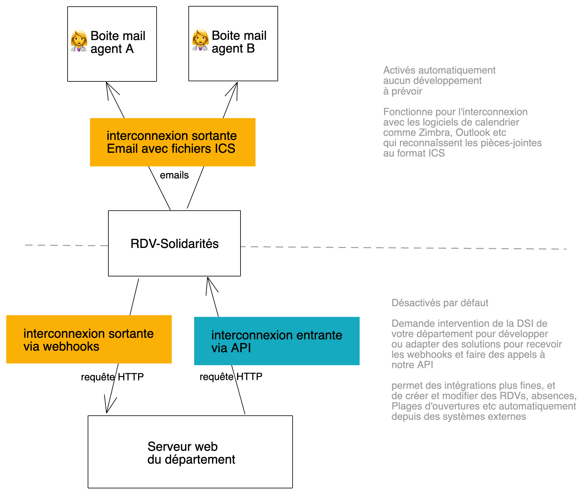

# Interconnexions aperçu

## Interconnexion sortante via email

Cette interconnexion est activée automatiquement. Elle fonctionne pour l'interconnexion avec les logiciels de calendrier comme Zimbra, Outlook etc qui reconnaîssent les pièces-jointes au format ICS

## Interconnexion sortante via webhooks

Désactivée par défaut. Nécessite l'intervention de la DSI de votre département pour développer ou adapter des solutions pour recevoir les requêtes webhooks envoyée par RDV-Solidarités



## Interconnexion entrante via API

Désactivée par défaut. Nécessite l'intervention de la DSI de votre département pour développer ou adapter des solutions pour faire des appels à l'API de RDV-Solidarités

Elle permet des intégrations plus fines, et de créer et modifier des RDVs, absences, plages d'ouvertures etc... automatiquement depuis des systèmes externes



