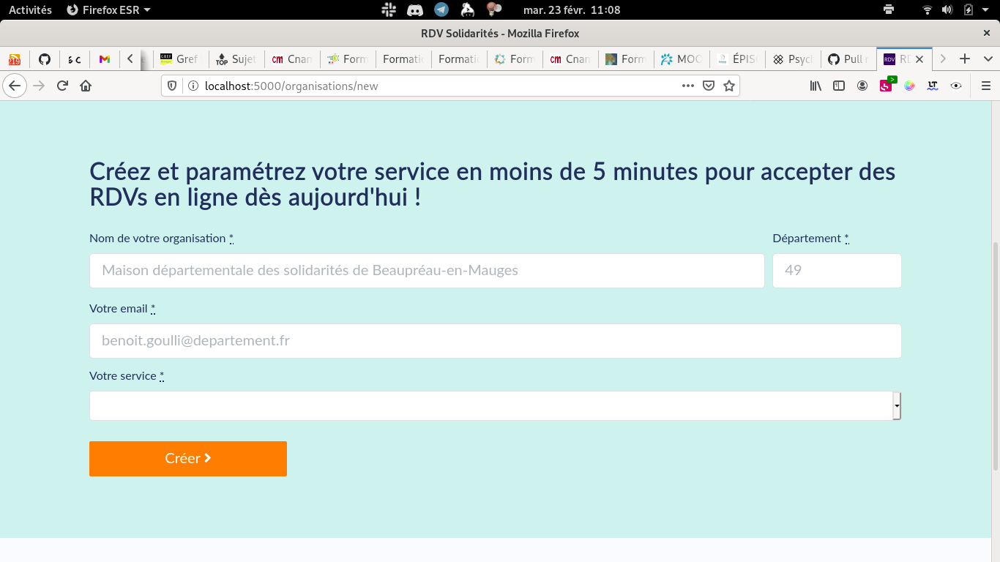

# Créer une organisation

Il y a deux façons de créer une organisation dans un département.

### La première organisation d'un département

C'est en général le cas quand aucun agent n'a encore de compte utilisateur sur RDV-Solidarités.

Pour accéder à ce formulaire, depuis [rdv-solidarites.fr](https://www.rdv-solidarites.fr/) choisissez « espace agent », puis, déroulé un peu l'écran pour cliquer sur le bouton « Créez votre service ». 

Une fois le formulaire rempli, l'équipe de RDV-Solidarités vous contactera. La création passe par une étape de validation manuelle.

### Ajouter une organisation au département

Une fois que vous avez un compte agent qui fonctionne, et au moins une organisation, vous devez passer par un autre chemin pour créer une organisation.

Une fois connecté, allez sur l'écran  « mes organisations ».

Vous devez ensuite cliquer sur le bouton « Créer une nouvelle organisation »

Une fois ce formulaire rempli, l'organisation est automatiquement créée \(pas de validation manuelle par l'équipe\). Vous serez considéré comme la personne administrant cette organisation.

