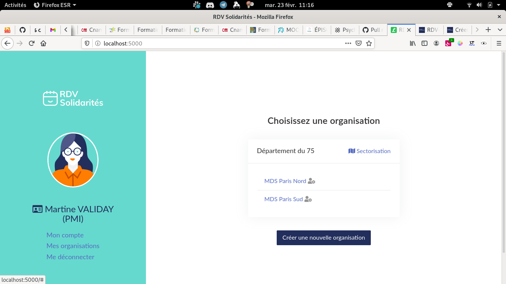
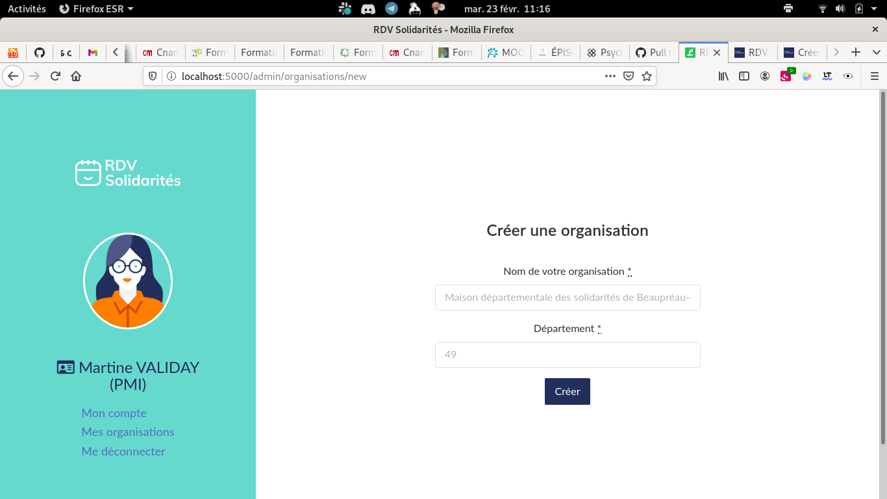

# Créer une organisation

Il y a deux façons de créer une organisation dans un département.

### La première organisation d'un département

C'est en général le cas quand aucun agent n'a encore de compte sur RDV-Solidarités.

Pour accéder à ce formulaire, depuis [rdv-solidarites.fr](https://www.rdv-solidarites.fr/) choisissez « espace agent » puis cliquez sur le bouton « Créez votre service ». 

Une fois le formulaire rempli, l'équipe de RDV-Solidarités validera votre demande et vous recevrez un mail de confirmation.

### Ajouter une organisation au département

Une fois que vous avez un compte agent, vous devez passer par un autre chemin pour créer des organisations supplémentaires.

Une fois connecté, allez sur l'écran  « Mes organisations ».

Cliquez ensuite sur le bouton « Créer une nouvelle organisation »

Une fois ce formulaire rempli, l'organisation est automatiquement créée \(pas de validation manuelle par l'équipe\) et vous aurez le rôle Administrateur dans cette nouvelle organisation.

