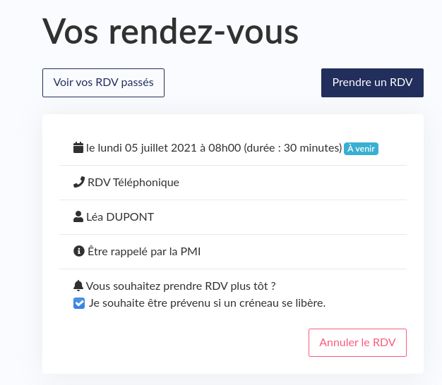
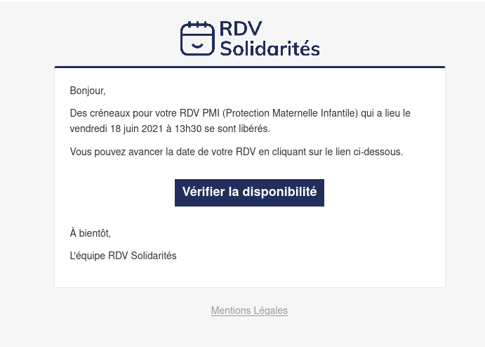
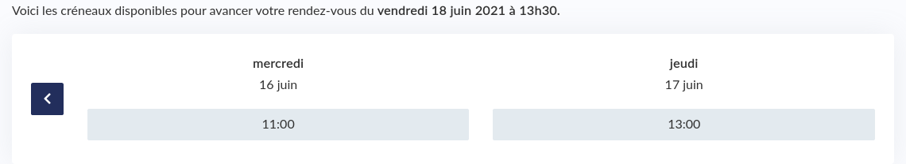
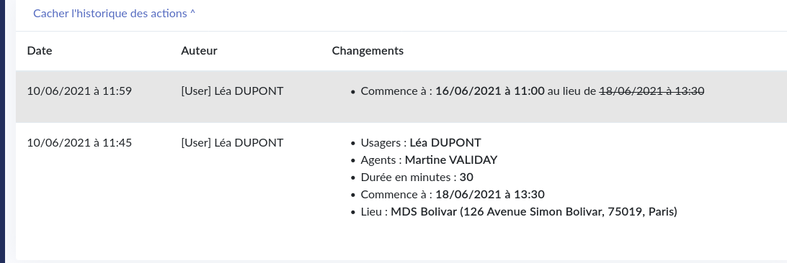

# File d'attente

### Activation

L'usager est à l'initiative de la demande de se placer sur file d'attente.

La case a coché « je souhaite être prévenu si un créneau se libère » est accessible dans la liste des rendez-vous de l'usager.

Cette case à coché est visible pour tous les rendez-vous qui ont lieu dans plus de sept jours et qui ne sont pas à domicile \(donc uniquement disponible pour les rendez-vous sur place et au téléphone\).

### Propositions

Toutes les 10 minutes entre 9 heures et 19 heures, est déclenché.

On liste tous les rendez-vous qui sont dans plus de sept jours, trié par date/heure de création. Nous ne considérons que les rendez-vous à domicile ou sur place. On utilise ensuite une fourchette d’aujourd'hui à deux jours avant le début prévu du rendez-vous initial pour la recherche de créneaux disponible. 

S'il y a un créneau disponible, nous regardons ensuite si nous avons envoyé moins de trois notifications \(proposition\) sur cette file d'attente, et que si nous avons déjà envoyé une notification, ce n'est pas aujourd'hui.

### Notifications

Une notification par SMS et une par email.

Si l'usager le souhaite, il va pouvoir modifier son rendez-vous.

 L'usager choisi un des créneaux disponible.

À noter que le choix de l'usager s'inscrit dans les traces historiques d'un rendez-vous comme suit: 

