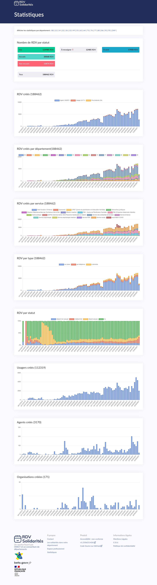
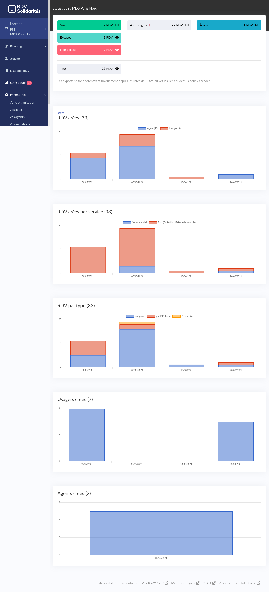
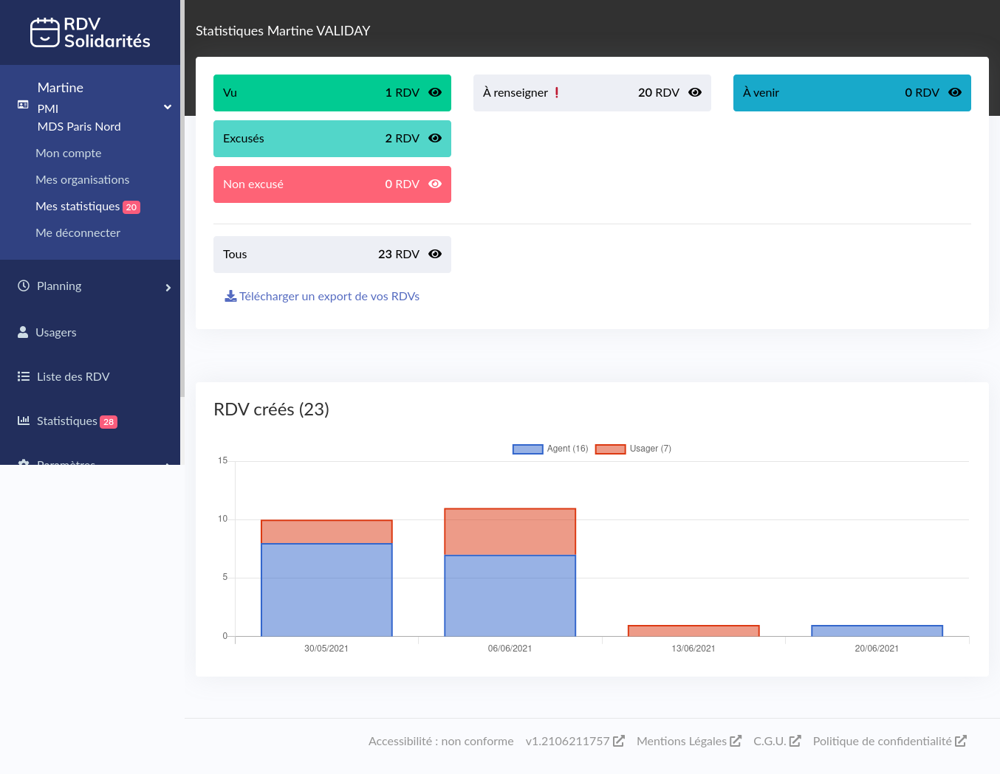
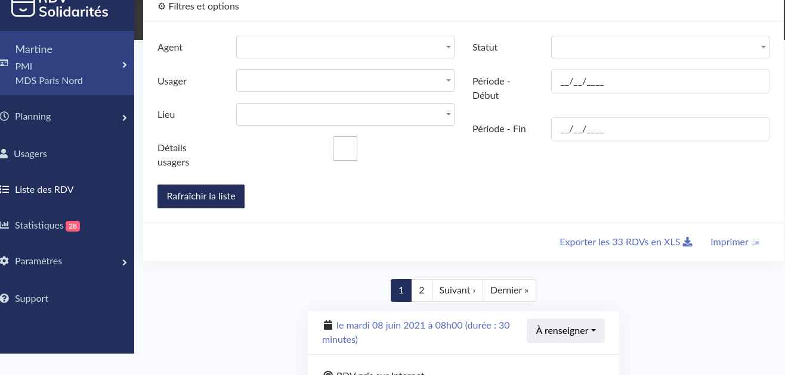

# Statistiques

### Publique

RDV-Solidarités propose des statistiques publiques à l'adresse [https://www.rdv-solidarites.fr/stats](https://www.rdv-solidarites.fr/stats).

La page propose 

* un filtre par département
* la quantité de rendez-vous par status
* les rendez-vous créés par semaine
* le cumulé de rendez-vous par département \(disparait si filtré pour un département\)
* cumul de rendez-vous par service, par semaine
* cumul de rendez-vous par type
* répartition des rendez-vous par status
* quantité d'usagers créés
* quantité d'agents créés
* quantité d'organisations créées

### Organisation

La page de statistique pour une organisation est accessible à tous les agents d'une organisation. Les informations sont filtrées en fonction des accès de l'agent connecté.

Une pastille rouge indique le nombre de rendez-vous à renseigner à côté de l'entrée de menu

Cette page liste

* la quantité de rendez-vous par status
* le cumul de rendez-vous créé par les agents et les usagers, par semaine
* le cumul de rendez-vous créé par service, par semaine
* le cumul de rendez-vous créé par type, par semaine
* la quantité d'usagers créée par semaine
* la quantité d'agents créée par semaine

### Individuel

Il y a sensiblement les mêmes informations que les statistiques de l'organisation, sauf qu'ici elles sont filtrée sur l'agent connecté.

### Outil de requête

L'équipe a mis en place un outil de requête branché sur la base de données de production en lecture seule. 

L'outil en place est [metabase](https://www.metabase.com/), à l'URL [https://metabase-rdv-solidarites.osc-secnum-fr1.scalingo.io/](https://metabase-rdv-solidarites.osc-secnum-fr1.scalingo.io/)

Actuellement, c'est principalement l'équipe qui l'utilise. Il y a une requête qui est utilisé par le 77, accessible uniquement via des comptes créé par l'équipe.

### Export

Nous avons également la possibilité de faire des exports.

Il existe un export accessible aux agents depuis la liste des rendez-vous. Cet export est au format Excel, une ligne par rendez-vous. Ça pose un souci pour les agents qui peuvent être plusieurs par RDV, ainsi que pour les usagers qui, eux aussi, peuvent-être plusieurs par RDV.

Nous avons également la possibilité de générer des fichiers CSV contenant l'intégralité des données d'une organisation.

_Nous envisageons d'étendre ce script pour extraire l'ensemble des données d'un département, au format SQL ou CSV._ 

