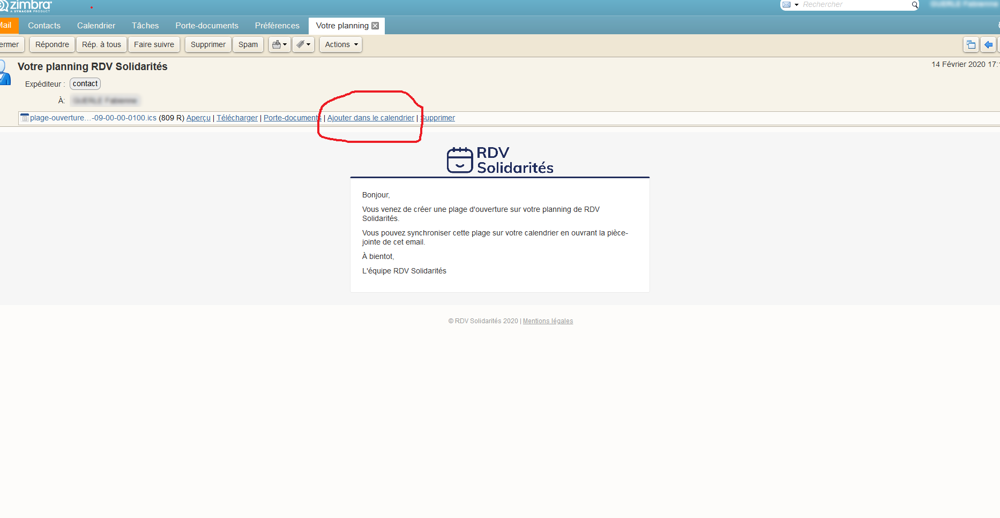
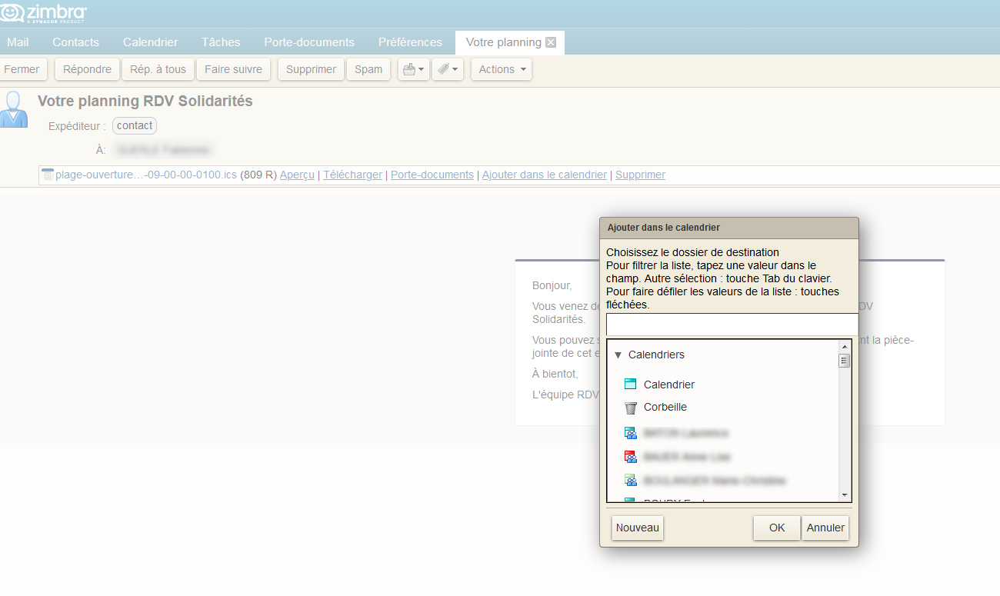
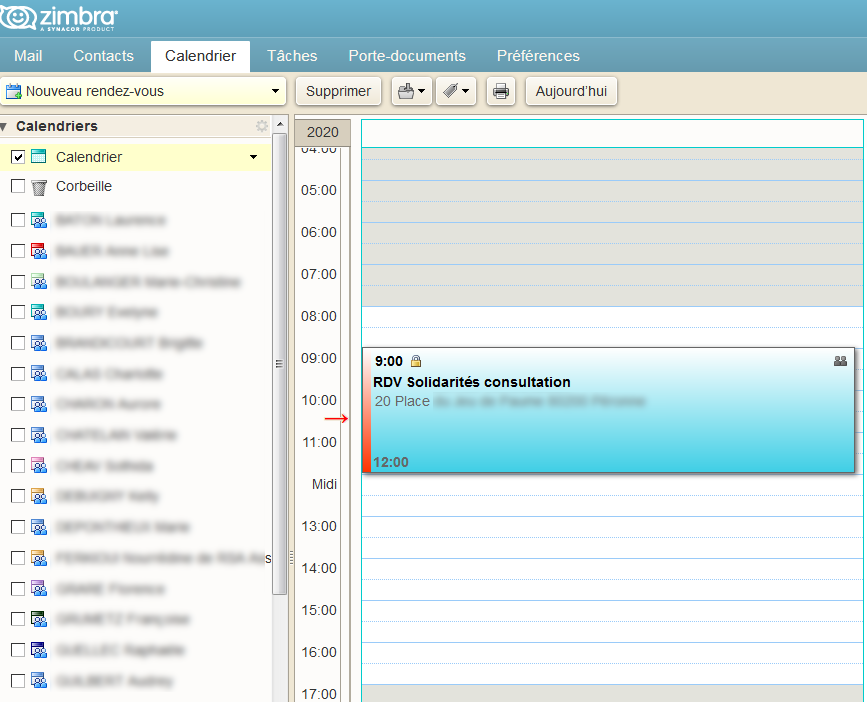

# Zimbra

1. Après avoir défini une plage d'ouverture pour la prise de RDV dans RDV-Solidarité, un email est envoyé avec la possibilité d'ajouter à l'agenda dans Zimbra
2. Quand on clique sur ajouter à l'agenda, il est demandé l'agenda auquel l'évènement dont être ajouté
3. La plage est affichée sur l'agenda choisi ce qui bloque donc le créneau correspondant à la plage horaire créée

En images   

